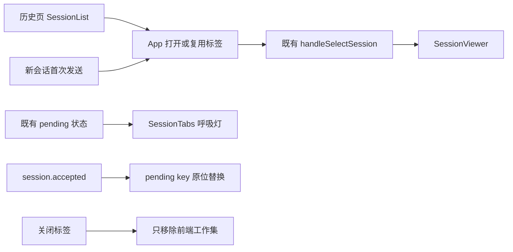

# IDEA 会话标签工作集

## 1. 定位与受众

供修改 IDEA 会话导航、会话恢复和运行状态展示的开发者使用。该能力解决“后台已支持多会话，但几个活跃会话切换仍要反复进入历史页”的问题；它只增加前端打开视图，不建立新的会话状态机。

## 2. 结构与交互

`SessionTabs` 是独立展示组件，接收扁平的 `key/label/pending` 投影并发出选择、关闭事件。它负责 roving tab focus、方向键/Home/End、长标题、自动滚动和左右溢出按钮；不读取会话服务，也不发取消或删除请求。少量标签弹性等分全部可用宽度，达到最小宽度后才溢出；标签栏不承载当前会话的消息摘要等上下文动作。

`App` 按 root 保存 `OpenSessionTab[]`。历史选择仍进入 `handleSelectSession`；新会话首次发送时先用 `pending-*` 打开当前标签，服务端接受后由既有提升路径原位换成真实 key。关闭当前标签优先选择右侧、再选左侧；没有相邻项时回新会话空白页。

## 3. 数据与状态

标签身份是 `root_id + session key`，项目之间隔离。工作集只保留标题、Agent、类型和 pending 等轻量显示元数据；标题和运行态在渲染时继续从当前会话、当前项目 session 列表和缓存投影，避免复制正文或建立第二份运行事实。

运行指示复用既有 `pending`，完成只停止呼吸灯，不自动关闭标签。关闭标签只改变工作集；后台会话、队列、WebSocket 和历史记录保持不变。删除会话、移除项目或 root ID 迁移时同步清理/迁移标签，避免悬空入口。

标签工作集只在当前 JCEF/React 生命周期存在，不写 localStorage 或后端。历史页仍是完整会话列表和搜索入口，也是关闭标签后的重新打开路径。IDEA 历史页的搜索输入始终可见，受控查询在 120ms 防抖后调用既有搜索接口；一个字符即可触发，清空查询立即回到完整列表。

用户消息摘要属于当前会话导航，由 `IdeaWorkbench` 放在输入框上方的上下文操作行右侧，与左侧“加入当前文件”并列；按钮使用“消息 N”而不是裸数字，弹层向上展开。这样标签栏只表达打开会话，摘要入口的作用域始终落在当前对话。

## 4. 已知约束

- 当前只在 IDEA runtime 主区域挂载；Web/PWA 原布局不改变。
- 不跨 IDEA 重启恢复打开标签。
- 设计目标是常见的 2–5 个并行会话；超出宽度使用水平滚动和自动定位，不引入分组或复杂窗口管理。
- 聊天态不再显示重复的会话大标题；会话名称只在标签中出现。历史和设置仍保留独立页面标题。
- 深浅主题对标签栏使用 IDEA 明确面板色，避免 JCEF 运行时主题切换时组合色保留旧计算值。
