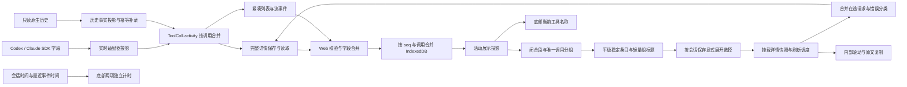

# 共用工具活动展示

## 1. 定位与受众

供修改会话展示、适配工具事件和排查工具详情问题的开发者使用。记录已完成的 F1 单项轻量行、F2 原生事实链路与 F3 共用语义摘要、F4 历史/缓存一致性、F5 详情生命周期与 F6 连续活动分组，区分工具事实、摘要、详情和会话计时的职责。

## 2. 结构与交互

`SessionViewer` 把原时间线交给 `ActivityTimeline` 做分组显示投影，正文和工具保持原顺序，提问走 `AskUserQuestionCard`，其他工具进入 `ToolCallCard`。卡片使用 `buildToolActivityView` 计算摘要、状态和可用耗时；普通 execute/read/list/search/web_search/fetch/MCP 使用 `ToolActivityHeader`。文件修改和任务外层名称也消费该摘要，单文件不再重复显示文件名；原 diff/任务详情和用户 shell 分支保留。

轻量头部只接受摘要、状态/耗时文字、图标类别、展开状态和切换回调；自身不请求网络、不保存会话状态。无详情时呈现非交互文本，有详情时提供带 `aria-expanded` 的按钮。头部使用主题次级文字、单色图标、单行省略和至少 24px 的交互高度。

## 3. 数据与状态

`ToolCall.activity` 是可选的 `ActivityFactsV1`：包含版本、Agent、实时/导入来源、操作种类、调用来源，以及可用的原生轮次、明确父调用、读/列目录/搜索动作、描述、工具名、终态和 `durationMs`。它不存本地化摘要，也不重复存完整命令、日志或 diff；原文仍在既有详情字段与文件中。

Codex SDK 保留命令和 MCP 原生耗时，实时 started/updated/completed 入口由 `mapLiveToolItem` 生成事实。命令动作全部已知时逐项投影；原生空数组或混合未知动作投影为空数组以清除先前动作，缺失时保留既有值。`nativeTurnId` 只在现有完成事件可读时提供。失败退出码和原生终态保留区别；无状态的普通更新保持 running，完成事件携带未知状态则显示 unknown。

Claude SDK 保留 `tool_result` 的 `tool_use_id`、`content`、`is_error`。实时 Assistant 入口从工具名/参数生成事实，包括 Bash description、Read/Grep 动作、MCP server/tool 和明确父调用。一条消息的多个结果按各自 ID 匹配；重复结果不占用其他待完成调用。原生拒绝保留 declined，Bash 的取消/中断优先于通用错误标记；任意 MCP 业务返回字段不用于判断执行失败。未提供工具耗时的调用没有 `durationMs`。

会话 Manager 与 usecase 缓冲去重按调用合并事实：缺失字段保留，描述/工具信息逐字段补充，显式 actions 整体替换。更晚的有序终态可修正之前结果，running 重放不能回退终态。克隆隔离嵌套可变字段，紧凑列表/流事件保留事实，完整原始输出仍按需读取。

Web 在网络与缓存边界校验事实版本和结构；未知或损坏事实降级到旧 title/status/meta，不妨碍旧工具展示。Go 的可选事实解码失败使用不受支持的版本 0 标记，以保留外层旧记录。`durationMs` 仅接受有限非负数，0 有效；Web 以毫秒或秒本地化显示。非法耗时在可独立解析时省略。

两个历史 importer 现在保留已支持的工具种类，服务层不再二次过滤读取/搜索等记录。Claude 从 tool_use 名称/参数复用事实计算，导入 origin 为 imported，保留 Read/Grep 动作、Bash description、MCP 名称及明确父调用；tool_result 按自身 ID 匹配，原生 system/permission_denied 保留拒绝结果。Codex 的 function/custom call 保留原参数与特殊内容；原生 ThreadItem 使用 SDK 和实时投影，turn_context/item.completed 的明确 turn ID 可传递。原生缺字段不生成工具耗时，也不从格式化 stdout 推断结果。

重复原生工具条目保留首次位置并合并结果；重复导入已有绑定复用原会话。完整同步绕过文件游标，先以调用 ID 和所属 Agent 的有序正文锚点补录已有 aux，再追加尾部。旧版遗漏的仅含工具的响应可附着于明确匹配的用户 seq 后，保留所有正文与 seq。明确重导入某个 Agent 时使用该绑定，避免混合会话默认 Agent 替代请求对象。无法匹配的旧前缀继续降级，不猜位置或改写正文。

`Manager.ReconcileImportedTools` 在存储锁内批量读取和原子改写派生 aux；合并重复调用时保留首次位置和完整详情，补入先前过滤的工具时使用后续原生调用作为顺序锚点。已有更完整的 live 事实优先于历史通用投影。快速同步遇到旧调用的迟到结果时补充原调用，HTTP 同时返回包含旧 seq 的紧凑 aux；没有变更的文件仍走原游标快路径。

Web 首次恢复未标记会话或显式完整同步时请求整份紧凑历史；服务端完成后返回 `activity_history_version=1`，缓存在同一会话记录内保存此标记。后续普通同步仍按 maxSeq 请求增量，按 seq/调用 ID 合并，旧缓存中的重复调用也归并。IndexedDB 版本保持 4，不删除 store，不影响其他会话或草稿。日志不可用时回退读取现有服务端记录，离线保留缓存；失败不标记完成。当前有 pending 用户时暂缓历史导入，接口返回原 pending 记录和时间戳，不伪造新的会话进展。

时间线工具项携带可选 agent/sourceTurnKey；有效 activity.agent 优先，否则使用所属 exchange.agent，不读取当前 Agent 选择器。sourceTurnKey 优先明确原生 turn ID，否则为最近已保存用户的 seq；未保存用户开启新边界，不沿用上一轮。没有可靠 Agent 或轮次则留空。无 call ID 不建立远程详情引用；普通折叠历史只消费紧凑数据，不逐项加载完整详情。

`ToolActivityView` 是纯前端投影，不持久化。有效事实的结果/操作/来源/Agent 优先；`buildActivitySummary` 统一选择描述 → 结构化动作 → MCP 可读名称/服务与工具名或保守命令预览 → 种类/状态缺省。旧数据使用 meta、可解析的 input 和 locations，最后保留有意义的旧 title；不从格式化标题反推混合命令动作。

摘要覆盖读取、目录、搜索、网页、抓取、修改、任务与 MCP；原生 execute 的读动作可以显示“读取 README.md”，但不会改变其 execute 事实。多种已知动作使用操作数量摘要，空动作不伪装为只读。固定文案支持中英文，原生描述/查询/名称保持原文，稳定 key 不依赖语言和文字。

命令预览只取首个非空行，可靠的简单 sh/bash/zsh 包装可在预览中去除；多行、heredoc、PowerShell、嵌套和复合脚本使用通用脚本摘要，不完整或复杂引号保守降级。摘要和 preview 均最多 100 个 Unicode 码点，完整命令仍在详情。路径在已知根目录分隔符边界内缩短，Windows 分隔符和盘符可识别。计算层不读取日志正文、不执行字符串、不请求网络；旧 input JSON 超过 32 KiB 时不为摘要而解析。

`ToolCallCard` 委托 `useActivityDisclosure` 管理展开选择：应用内单例按 root/session/call 保存主动 open/closed，无 call ID 使用 SessionViewer 传入的稳定时间线 localKey，仅保存本地选择。普通工具默认收起、用户 shell 默认打开，显式选择高于默认/更新/终态/语言。LRU 最多 50 个会话、每会话 500 个选择，当前聚焦条目与所属会话受保护；刷新/重启恢复默认。不保存输出；call/local/group 使用不同命名空间，组与条目合计受同一个 50/500 上限约束。

`useActivityDetails` 只在展开且具有完整 ActivityRef 时调用 `loadActivityDetails`，命令和普通工具即使有紧凑内联输出也可获取完整详情；已有完整 diff/任务保留特殊展示。ActivityRef 使用 rootId/sessionKey/callId 三元组编码；模块表只合并在途请求，消费者独立取消，最后一个取消才终止底层请求，完成后移除，不缓存完整结果。完整快照只保存在挂载 hook 内，并在渲染时核对身份，迟到响应无法进入新卡片。

`sessionService.getToolCallDetails` 复用原 HTTP 接口，返回 loaded / missing / unavailable；200 null 和 404 为 missing，网络/408/429/5xx 可主动重试，参数/认证/权限错误不自动重试。旧 getToolCall 保持 ToolCall/null 返回契约。卡片使用本地化提示，加载与错误不遮住内联内容；展开失败后不循环重试。运行中成功详情每次完成后至少间隔一秒再取，收起/卸载停止后续请求，终态补取一次最终快照，包括终态在请求中途到达；已有终态快照在同一挂载期重开可复用。背景刷新不插入加载行扰动阅读。

快照不能覆盖更新的流状态/事实；普通日志只有完整快照包含现有流前缀时才替代内联内容，移除紧凑截断标记后同样比较。详情有独立滚动容器，距底部 48px 内跟随新输出，向上滚动后保留位置；工具区指针/触摸/滚轮/聚焦使 SessionViewer 暂停自动跟随，原“回到底部最新消息”恢复。原文复制通过已有 clipboard 服务，中英文成功/失败反馈与焦点保持，不复制摘要；明确截断而尚未取到完整结果时不提供输出复制入口。

流 hook 对结束轮次里残留的运行工具显示状态未知，不生成成功事实；提问与任务沿用特殊生命周期。详情加载、重试、轮询、复制均不发出会话进展，不修改 lastEventAt。

`projectActivityTimeline` 使用共用 ToolActivityView 和稳定时间线 ID，将活动映射回原条目/索引；同调用重复更新在首次位置消费最新数据。`groupCompletedActivities` 是无网络/计时副作用的纯函数，只有具有完整 root/session/call 引用、可靠 Agent/轮次的普通操作才可聚合。至少 3 个连续 completed 操作成组；execute/read/list/search/web_search/fetch/MCP 为候选，运行项不入组。文件变更、任务、用户 shell、等待交互、失败/拒绝/取消/中断/未知状态保持单列；raw kind/meta 和 typed diff 是额外保守边界，不从输出文本猜测工具种类。

所有正文、用户消息、思考、计划/todo/压缩及 Agent/轮次/会话变化切段。普通 running 条目仍属于正在增长的普通段，防止前面的完成项在执行过程中反复收组；后继边界出现后，才把段内连续完成子段聚合，运行项仍单列。会话 pending 或 streaming 时普通尾段不自动收组；历史加载结束且二者均结束，或存在后继 slash 展示边界时可关闭尾段。断连/恢复文字不是轮次完成证据。

组 key 使用 root/session、Agent、sourceTurnKey 和首成员稳定 key，不依赖标题、语言或成员总数。全部 execute 显示本地化“运行了 N 条命令”，其他组合显示“完成了 N 项操作”；N 按唯一调用计算，不合计工具耗时或生成业务结论。

`ActivityTimeline` 为成员始终使用相同的平级 React 父级和 key，自动成组只插入标题并缩进，不替换正在阅读的详情 DOM。普通组默认关闭；`useActivityGroupChoices` 复用 store 的选择/焦点订阅，新组继承显式打开子项或当前焦点所表达的阅读选择，随后不因 blur 自动收起。用户关闭组可卸载成员，条目选择仍保存；再展开只对先前明确打开的子项恢复详情，其余子项不取日志。组标题使用原 ToolActivityHeader，aria-controls 引用展开成员容器，关闭成员不进入 Tab 顺序；工具区滚动暂停/跳最新继续沿用 F5。

`SessionActivity` 每秒更新自己的时钟，按本轮用户时间与最近有效事件时间显示“已等待”和“最近更新于”。事实投影、工具耗时格式化、展开与重绘不构成新的会话进展；新事件仍按原规则更新最近事件时间。当前工具名称调用同一 `buildToolActivityView`，按工具/语言/路径上下文记忆结果，时钟 tick 不反复解析参数。仅工具名称单行省略；断连、待回答、发送、恢复、思考和等待的优先级与其他文案显示规则保持原实现。

## 4. 关键决策

来源为用户确认及已批准的 roadmap：Codex 与 Claude 共用展示；范围限工具活动及其与正文的层级；“用了多少秒，距离上次更新多少秒”必须保留。真实结果与原生工具耗时独立于会话计时；数据缺失时保守降级。F1–F6 已落地；闭合段分组仅属于显示投影，原 timeline 仍供正文索引、跳转及 SessionActivity 使用，组开关不产生新的会话进展。展开选择归有界内存，完整快照归挂载条目。

## 5. 代码锚点

- [Go 事实契约](../../runtime/server/internal/agent/types/activity.go)：`ActivityFactsV1`、`MergeActivityFacts`、`MergeToolStatus`、`CloneActivityFacts`。
- [Codex 实时投影](../../runtime/server/internal/agent/codex/activity.go)：`mapLiveToolItem`、`codexActivityActions`。
- [Claude 实时投影](../../runtime/server/internal/agent/claude/activity.go)：`claudeActivityFacts`、`claudeToolOutcome`、`toolResultUpdates`。
- [会话 Manager](../../runtime/server/internal/session/manager.go)、[紧凑投影](../../runtime/server/internal/session/types.go)、[usecase 服务](../../runtime/server/internal/api/usecase/session.go)：完整保存、克隆、缓冲合并、流投影与详情读取。
- [历史补录](../../runtime/server/internal/api/usecase/import_activity.go)、[派生 aux 合并](../../runtime/server/internal/session/import_activity.go)、[HTTP 历史响应](../../runtime/server/internal/api/http.go)：完整/快速同步、调用去重、可靠位置与 pending 保护。
- [历史事实计算](../../runtime/server/internal/agent/codex/import_activity.go)、[Claude 历史事实](../../runtime/server/internal/agent/claude/import_activity.go)、[缓存合并](../../runtime/web/src/services/sessionHistory.ts)：复用事实、幂等合并与逐会话补录标记。
- [Web 事实入口](../../runtime/web/src/services/activityFacts.ts)、[展示模型](../../runtime/web/src/services/toolActivity.ts)：校验、字段合并和无网络的展示投影。
- [语义摘要计算](../../runtime/web/src/services/toolActivitySummary.ts)：描述/动作/命令/MCP/旧字段的本地化投影，不读取工具输出。
- [App](../../runtime/web/src/App.tsx)、[流 hook](../../runtime/web/src/hooks/useSessionStream.ts)、[SessionViewer](../../runtime/web/src/components/SessionViewer.tsx)：事件合并、终态规范化、无结果收尾与时间线入口。
- [ToolCallCard](../../runtime/web/src/components/stream/ToolCallCard.tsx)、[轻量头部](../../runtime/web/src/components/stream/ToolActivityHeader.tsx)、[样式](../../runtime/web/src/components/stream/ToolActivityHeader.css)：事实消费、详情所有权和轻量展示。
- [展开存储](../../runtime/web/src/services/activityDisclosure.ts)、[展开 hook](../../runtime/web/src/hooks/useActivityDisclosure.ts)：应用内显式选择、LRU 和焦点保护。
- [详情请求](../../runtime/web/src/services/activityDetails.ts)、[会话 API](../../runtime/web/src/services/session.ts)、[详情 hook](../../runtime/web/src/hooks/useActivityDetails.ts)：结构化失败语义、消费者取消、身份隔离与运行/终态快照调度。
- [滚动 hook](../../runtime/web/src/hooks/useActivityDetailScroll.ts)、[反馈与复制](../../runtime/web/src/components/stream/ActivityDetailFeedback.tsx)：阅读位置、原文复制及本地化反馈；SessionViewer 负责外层阅读暂停与恢复。
- [分组投影](../../runtime/web/src/services/activityGrouping.ts)：ActivitySegmentEntry/ActivityGroup、闭合段、保守边界与唯一调用。
- [ActivityTimeline](../../runtime/web/src/components/stream/ActivityTimeline.tsx)、[局部缩进](../../runtime/web/src/components/stream/ActivityTimeline.css)、[组选择 hook](../../runtime/web/src/hooks/useActivityGroupChoices.ts)：稳定平级渲染、组标题、阅读选择继承与两层展开。
- [SessionActivity](../../runtime/web/src/components/SessionActivity.tsx)：共用当前工具名称，独立运行状态与两项计时；计时与优先级算法未改变。

Codex 0.154 的 rollout `custom_tool_call exec` 与 app-server 内层 commandExecution 使用不同调用 ID。importer 在 meta 保留 wrapperTool/wrapperInput；同一 nativeTurnId 已有 live commandExecution 时，usecase 不额外插入执行包装层。不按命令文本/时间猜身份，独立导入、其他轮次/工具保留。包装输出仅带 chunk_id/exit_code 的 input_text JSON 原生执行信封用于判失败；包装层完成不覆盖内层失败。没有可靠内层 ID 时无法靠该包装补齐同轮漏失的命令。

## 6. 已知约束 / 边界情况

- 没有原始日志、或旧正文已被不同版本合并到无法可靠对应时，只保留可确认的调用补录和原字段降级；不重写原生历史或用户正文。
- 不从 stdout 的“error”等字样判断状态，不用整轮耗时冒充工具耗时，不从时间相近推导父子关系。来源：roadmap §4.1、F2 S2/S3。
- 用户 shell 保留默认展开；文件修改、子任务、审批与提问保留原交互。来源：用户范围及 F1/F2 验收。
- 不把计时藏入详情，不因工具开关重置；结束后显隐沿用会话生命周期。来源：用户明确要求及计时回归。
- 只聚合已闭合的可靠连续完成段；缺 call ID/Agent/轮次时单列。组和条目共用 50/500 内存上限，LRU 淘汰，刷新恢复默认；没有永久偏好或输出缓存。
- F1–F6 证据包括固定实时/导入协议样例、幂等落盘重读、HTTP 接口和真实浏览器 IndexedDB 恢复、卡片与 SessionViewer 的并发/滚动/复制及分组/焦点/问答提交；F7 已通过真实 Codex 0.154 成功/失败与完整历史同步、16 组浏览器布局和大历史/日志验证；Claude 2.1.270 实测 180 秒无终态，IDEA/JCEF 交互尚未完成，整体仍未验收。

## 7. 相关文档

- [能力定义](../requirements/compact-tool-activity.md)
- [F1 验收](../features/2026-09-14-activity-compact-rows/activity-compact-rows-acceptance.md)
- [F2 设计](../features/2026-09-14-activity-native-facts/activity-native-facts-design.md)
- [F2 验收](../features/2026-09-14-activity-native-facts/activity-native-facts-acceptance.md)
- [F3 验收](../features/2026-09-14-activity-semantic-summaries/activity-semantic-summaries-acceptance.md)
- [F4 验收](../features/2026-09-14-activity-history-parity/activity-history-parity-acceptance.md)
- [F5 验收](../features/2026-09-14-activity-detail-lifecycle/activity-detail-lifecycle-acceptance.md)
- [F6 验收](../features/2026-09-14-activity-segment-grouping/activity-segment-grouping-acceptance.md)
- [后续规划](../roadmap/tool-activity-experience/tool-activity-experience-roadmap.md)

## 8. 变更日志

- 2026-09-14：F3 归并共用语义摘要、命令预览边界、文件/任务外层名称和底部名称消费关系，保留既有会话计时及状态优先级。

- 2026-09-14：F4 归并双 Agent 历史事实、幂等补录、缓存按身份合并、pending 保护与时间线 Agent/轮次归属；两项计时沿用原实现。

- 2026-09-14：F5 归并显式展开选择、有界内存、详情请求错误/取消/快照调度、阅读滚动和原文复制；底部两项计时继续独立。

- 2026-09-14：F6 归并闭合段连续分组、唯一计数、可靠边界、稳定平级成员和组/条目展开选择；正文、异常/特殊操作与两项计时保持独立。

- 2026-09-14：F7 部分归并。真实 Codex 暴露并修复外层 exec 包装重复及失败误判；增加可复现浏览器/原生验证和本地包证据。Claude/JCEF 保持未完成。
