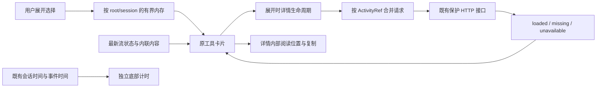

# F5 展开与详情生命周期

授权沿用用户对整体路线图的批准及本轮“继续”；F1–F4 已完成，按 cs-feat-design / impl / accept 实施与验收，不重复请求审批。

## 0. 术语约定

- ActivityRef：既有 rootId/sessionKey/callId，远程请求唯一身份；无 callId 使用时间线 localKey 记本地展开，不发远程请求。
- DisclosureChoice：用户的 open/closed 明确选择，只存在应用内存中。
- ActivityDetailResult：loaded / missing / unavailable，分别对应完整工具、明确缺失、取数不可用。
- 详情快照：当前挂载条目的完整详情；与传入的最新工具状态/原生事实分开合并，不写 IndexedDB。
- 跟随输出：详情内部原来靠近底部时可随新增输出滚到底；向上阅读后保留位置。与会话两项运行计时独立。

## 1. 决策与约束

落实 roadmap §4.2/§4.5/§4.7，Codex、Claude 共用。普通活动默认收起，用户 shell 默认打开；用户明确选择优先于默认值、更新、终态及重绘。内存按 root/session 隔离，最多 50 个会话、每会话 500 个选择，按最近使用淘汰并保护当前聚焦条目；刷新/重启恢复默认。

详情只在展开时主动加载。已有内联内容先显示；可能被紧凑投影截断的命令/普通工具展开后读取完整详情。文件 diff/任务等已有完整特殊内容沿用原展示。运行中已打开的远程详情成功加载后每秒至多刷新一次，结束时再取最终快照；收起或卸载停止后续刷新。错误/缺失不自动循环重试，用户可重试，新的终态允许再核对一次。并发相同引用合并，取消一个订阅不取消其他消费者；身份改变/卸载后迟到结果不得进入新条目。

HTTP 状态不改：200 null/404 为 missing；网络/408/429/5xx 为可重试 unavailable；认证/权限/参数错误为不可自动重试 unavailable。错误文案本地化且不展示内部实现细节。没有活动事实时继续旧字段降级，失败/取消/拒绝/中断不能被旧详情覆盖。

明确不做：F6 分组、永久展开设置、全局缓存/输出持久化、修改审批或问答流程、改变 diff/任务内部业务、修改正文内容/phase、计时来源或状态优先级、真实 CLI/IDEA 安装发布。默认工程档位，无新依赖。

## 2. 名词与编排

### 2.1 名词层：现状 → 变化

现状：ToolCallCard 内部 useState 管展开，getToolCall 将全部错误折成 null，远程快照优先于新 content；只对用户 shell 维护详情滚动，原命令和 ANSI 输出没有专用复制入口。来源为 ToolCallCard、session.getToolCall 和 SessionViewer 的滚动 effect。

变化：增加内存展开存储/订阅 hook，以及 ActivityDetailResult 请求层和详情生命周期 hook。卡片接收稳定 localKey，保留渲染责任，按当前事实与有身份的详情结果计算内容；公共计时组件继续独立。SessionViewer 仅在用户正在阅读工具详情时避免外层流更新抢滚动，不改其余跟随规则。

示例：A/call1 打开 → 切 B/call1 默认关闭 → 返回 A/call1 仍打开；刷新 A 默认关闭。用户 shell 手动关闭 → 新输出/完成后仍关闭。A 请求后立即切 B，即使 A 迟到，B 首帧到最终均不显示 A 内容。403 显示访问失败，500 可主动重试；同一原生失败工具不会因为取到旧 running 快照而改为运行中。

完整命令和可用原始输出有独立复制按钮，保留原文本，不复制摘要/ANSI 渲染截断；成功/失败提供本地化反馈，失败不伪装成功。复制和重试不移走原展开控制焦点。

### 2.2 编排层：现状 → 变化

现状：一次请求成功后不再更新详情，局部状态不跨会话保存；execute 分支会遮住加载/错误提示。

变化：详情状态按身份关联；运行中成功读取可有限频率刷新，终态补取；收起时不发新请求，在途请求只影响同身份状态。加载与错误提示独立于日志渲染，仍可阅读摘要和已有输出。新流内容优先更新可用日志，旧快照不能盖过更新后的状态；展开后仍可取完整输出以消除列表截断。完整输出只在挂载条目中保存，请求共享表只存未完成请求。

滚动约束：展开/详情增长不主动调用外层 scrollIntoView；详情区域有独立上限和滚动，普通日志与用户 shell 采用相同的底部意图判断。工具区域内的点击、聚焦、选择或向上阅读使外层暂停自动跟随，原“回到最新”可恢复。错误、复制、轮询和重绘不发送 session.stream，不更新 lastEventAt。

### 2.3 挂载点

1. 展开选择存储和订阅 hook，按稳定工具身份记录主动选择；为后续分组保留可读取条目选择的接口，本期不建分组。
2. session 的结构化详情读取与共享请求函数，不改变既有 getToolCall 消费者的返回契约。
3. 详情生命周期 hook 与 ToolCallCard：快照接入、错误/重试、滚动意图和复制控件；中英文词典及局部样式。
4. SessionViewer 的 localKey 与工具详情阅读滚动保护，原计时和问答分支保持。
5. 存储/请求的有界与错误测试、真实浏览器卡片/会话切换/滚动/复制及既有计时回归。

### 2.4 推进策略

1. 状态存储：实现 50/500 限制、隔离、主动选择和焦点保护；存储验证通过。
2. 请求与快照：实现明确错误语义、共享在途请求、订阅取消与更新调度；请求验证通过。
3. 交互接入：卡片、原始文本复制、滚动、特殊工具兼容；类型检查通过。
4. 场景验证：浏览器边界/亮暗窄宽度、计时/审批/历史回归及构建通过。
5. 验收归档：八项契约与九节报告完成，现状文档/roadmap 同步，仅 F5 标 done。

### 2.5 结构健康度与微重构

ToolCallCard/SessionViewer 已较大，本次新状态/请求逻辑放专用服务与 hooks 文件，局部反馈和复制控件放小组件，避免在卡片里再堆调度分支。现有目录能容纳这些明确职责，compound 无冲突规约。不做前置纯移动微重构，不改其他卡片或全局字体。

## 3. 验收契约

- S1：主动 open/closed 在更新/终态/语言/切换后保持，root/session/call 隔离，刷新恢复默认，用户 shell 可明确收起。
- S2：50 会话/500 选择限制、LRU 和聚焦保护有证据；无 ID 保持本地、无远程引用。
- S3：200 null/404/网络/408/429/5xx/400/401/403 错误分类正确，摘要/已有详情持续可读，重试无自动风暴。
- S4：相同调用并发共享请求；单订阅取消不影响他人；切换身份、卸载、返回原会话后迟到数据不串入。
- S5：运行中打开的日志更新、完成补取、终态不回退；关闭不继续取日志。向上阅读不跳底、不抢外层位置，跟随底部仍可工作。
- S6：复制完整命令/输出，成功/失败反馈可见；亮暗、320/375/720、键盘、焦点与无横向溢出核对。
- S7：两项计时、审批/问答、用户 shell、diff/子任务、缓存恢复回归通过；无 F6 分组或永久偏好。
- S8：类型/构建/相关测试通过，挂载点可定位，现状架构/能力/路线图及清单一致。

## 4. 架构与能力归并

ui-tool-activity 增加展开状态归属、共享请求、快照/滚动与错误语义；compact-tool-activity 补充应用内展开保留与详情恢复。同步两个索引、roadmap 主文档/items/验收矩阵，F6/F7 保持 planned。
