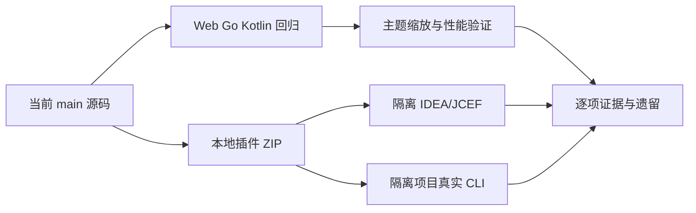

# F7 IDEA 就绪验证

沿用用户对整体方案的直接批准及本轮“继续”。F1–F6 已完成，F7 是最后一阶段。实现、验证和归档在本阶段连续推进，无需再次方案审批。

## 0. 术语约定

沿用 ToolActivityView、ActivityTimeline、ActivityGroup 和 activityDetails；不增加产品概念。验证包指当前源码的 macOS arm64 插件 ZIP；浏览器 fixture、真实 CLI、IDEA/JCEF 三种证据分别记录，互不替代。

## 1. 决策与约束

使用独立测试项目和隔离的 IDEA config/system/plugins/log 目录，保留用户现有 IDEA 及会话。原生 CLI 使用本机已有登录，仅向无敏感文件的测试项目发送读文件、成功命令和预期失败命令，不修改登录配置。基线采用同机同浏览器下的 1000 条逐项展示与 F6 闭合分组，记录测量分布，不宣称未经测量的优化倍数。

本地包保持 0.1.13 插件版本，文件名增加 activity-preview 和平台标识以区别正式发行；不修改正式下载链接、版本记录、不发布。真实环境受阻时保留 pending 的验收项及具体原因，不能标整体通过。只修本阶段实测暴露且属于活动区范围的问题。

两项计时、正文、原生工具终态、审批/提问/diff/任务业务、用户 shell 默认展开与显式收起保持。main 上 F1–F6 未提交改动全部保留；本阶段不提交推送。

## 2. 名词与编排

### 2.1 名词层

复用当前活动数据和展示 API，无生产协议变化。独立 readiness 测试记录宽度、缩放、主题、请求数、DOM 数、耗时和原生终态。示例：1000 项闭合历史 → 默认一个组、0 详情请求/日志 DOM；1 MiB 活跃工具 → 收起不读取/渲染日志，展开后准确显示，更新后不重复全量追加。

### 2.2 编排层

静态/协议测试和真实会话顺序独立；构建完成后再执行包内 runtime smoke。测试中不打印凭据。对真实 CLI 测试设置超时，保留错误摘要和可复现命令；测试进程退出时只清理由本阶段启动的进程。

### 2.3 挂载点

runtime/web/tests 的 readiness 测试复用 F6 SessionViewer fixture；scripts 中可复现的本地 runtime/CLI 验证脚本；生成证据放 build/reports/activity-ide-readiness，本地包放 build/local-distributions。发现活动区样式/详情实际问题时可定点修复相关组件并补回设计记录。IDE 启动配置只放忽略的 .tools 目录。

### 2.4 推进策略

1. Web 组合验证：四宽度、两主题、两缩放、键盘、对比、1000 项基线及 1 MiB 连续日志。
2. 原生回归与验证包：Go/Kotlin/TypeScript、生产构建和完整 App smoke，记录 ZIP 哈希。
3. 真实环境：两 CLI 工具成功/失败及历史返回；隔离 IDEA/JCEF 主题、缩放、键盘、复制和滚动。
4. 归档：九节验收记录、架构/能力/roadmap 同步；有未完成项则 F7 保持 in-progress。

### 2.5 结构健康度

不在 SessionViewer 增加测试入口，不添加生产调试后门。测试复用已有 fixture 与生产 runtime API，不扩展无关业务；不做额外重构或虚拟化。

## 3. 验收契约

- S1/V01–V05：320/375/480/720 CSS px、light/dark、100%/150%，无溢出、焦点可见、正确 aria-expanded、文字 4.5:1、入口至少 24×24。
- S2/V06：1000 条活动同机基线报告；收起零完整详情请求/日志 DOM，分组不扫描日志。
- S3/V07：1 MiB 连续更新内容准确，手动阅读不跳底，收起不渲染日志、不轮询。
- S4/V08：计时、stream、approval、question、历史/展开重点回归及 Go/Kotlin/TypeScript/构建通过。
- S5/V09：当前包真实 IDEA/JCEF 的主题、缩放、键盘、复制、滚动证据。
- S6/V10：Codex 与 Claude 各完成真实工具成功/失败、完成回答和历史返回验证。
- S7：本地 ZIP 可追溯版本/平台/哈希；无发布、无用户会话改写；未执行检查诚实留待完成。

## 4. 架构与能力归并

ui-tool-activity 记录实际环境验证边界；compact-tool-activity 保留愿景，仅按实际证据更新就绪程度。roadmap、items 和 acceptance-matrix 同步实际结果，不将 fixture 覆盖扩大为真实环境通过。

## 实测补充：Codex 0.154 的 exec 包装调用

真实 CLI 发现原生 rollout 的 `custom_tool_call exec` 是模型包装调用（call_ ID），app-server 显示的是内层 commandExecution（exec- ID），不能当作相同身份或额外三条成功命令。importer 在 meta 保留 wrapperTool=exec 和 wrapperInput；当同一可靠 nativeTurnId 已有 live commandExecution 时，历史补录不再额外插入没有稳定 ID 对应的执行包装层。独立导入的轮次、其他工具和同 ID 补录保持。这是保守去除包装层，不按命令文本或时间猜测 ID；没有内层 ID 的包装历史不能补全同轮漏失的内层命令，此限制如实记录。

包装执行结果是 input_text 数组，带 chunk_id/exit_code 的 JSON 文本才用于判定内层命令失败；不把脚本包装本身完成误称为命令成功，不执行/推算原始脚本。新增挂载点为 codex importer/import_activity 及 usecase/import_activity 和对应实测格式回归。原始单引号 JS 参数解析不扩展，保留 wrapperInput 供诊断。

S6 增加真实 UI 打开历史后再次完整同步的数量/失败核对，不能仅用首次 GET 历史通过替代。已污染的独立测试会话保留为问题证据，重新建干净验证会话；本阶段不迁移用户已有历史。
