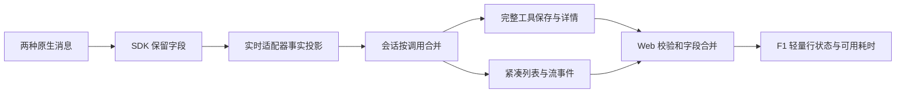

# F2 原生工具事实贯通

授权沿用用户对整体 roadmap 的明确批准及本轮“继续”。前置 F1 已 done；本阶段实现 roadmap §4.1，不重复请求方案评审。

## 0. 术语

- `ActivityFactsV1`：roadmap §4.1 已批准的可选 `ToolCall.activity` 事实，不存格式化 UI 摘要。
- `ActivityAction`：原生结构化读、目录、搜索动作；未知或混合未知命令不伪装成完整已知动作。
- `outcome`：具有工具结果证据的终态；轮次完成不构成每个工具成功的证据。
- `durationMs`：原生提供的单次工具毫秒耗时，0 有效，缺失/非法省略。
- 事实合并：同一调用更新只覆盖出现的字段；actions 出现时整体替换，支持空数组；终态不被旧 running 重放覆盖。

## 1. 决策与约束

在 F1 共用入口展示可靠的活动状态与可用耗时，同时为 F3 准备原生动作与描述。跨 Go/SDK/Web 契约必须向后兼容；除此之外走项目默认实现档位。

不做：两个历史 importer 的事实回填、连续分组、完整语义摘要目录、底部工具名称精简、新的详情请求/重试生命周期、输入区/工具栏变化。两项会话计时及特殊交互保持原规则；工具耗时独立于累计等待。

## 2. 名词与编排

### 2.1 名词层

现状：共享 ToolCall 没有活动事实；Codex CommandExecution/MCP 类型未保留 durationMs；Claude UserContentBlock 未保留 tool_result 的调用 ID、content 和 is_error。会话合并只处理顶层与 meta；前端轮次结束会把残留 running 改成 complete。

变化：Go/Web 增加 roadmap §4.1 的可选 activity。SDK 仅补保真所需字段；Web 校验版本和结构，未知版本/非法结构降级旧字段，非法耗时省略。Go 对无法解码的可选 activity 使用不受支持的版本 0 标记，让旧 ToolCall 仍可读取；可解码的负数/非有限耗时省略。新事实与旧详情共同传递，不覆盖完整命令和输出。来源为两个 SDK 消息类型、实时 session 适配器及会话 Manager 的现有保存接口。

输入输出示例：

- Codex commandExecution/completed、read action、durationMs=0 → agent=codex、origin=live、operation=execute、read action、outcome=completed、durationMs=0。
- Codex declined → outcome=declined；非零退出码 → failed；仅 item.updated 且没有终态 → 不补 completed。原生 completed 事件本身可为无 status 的工具提供完成证据。
- Claude Bash(description=检查配置) → displayLabel(tool_argument)，tool_result(is_error=true) → failed；无原生耗时不创建 durationMs。
- Claude 一条消息含多条 tool_result → 各按自身 tool_use_id 匹配，分别更新，不依赖并发先后；Assistant 的明确 parent_tool_use_id 才作为父关系。
- Claude permission_denied → declined；后续通用 is_error 不覆盖该拒绝证据。Bash 的明确 cancelled/interrupted 优先于同一结果的通用错误标记；其他工具的任意业务返回字段不作终态依据。tool_result.content 保留为原详情输出。
- 缺终态工具遇到轮次结束 → UI 显示状态未知，不能生成成功事实。

Codex commandActions 缺失时不更新 actions；原生明确为空或包含 unknown 时投影为显式空数组，清除之前的纯已知动作，避免后续误述混合命令。nativeTurnId 在现有完成事件可读时保留；其余缺少可靠身份时省略，不以 session ID 代替。

### 2.2 编排层

现状：原生事实部分丢在 SDK/适配器，更新可能覆盖先前信息，轮次收尾使状态过度乐观。

变化：在实时映射边界产生事实，完整保存/紧凑投影均保留；Go 和 Web 合并 activity 子字段及嵌套描述/工具信息，actions 整体替换。更晚的有序终态可修正早前终态，缺失字段和非终态重放不抹除结果。前端仅接入事实状态、描述和原生耗时，详细语义规则仍由 F3 实现。

错误约束：不从输出文字猜测业务成功/拒绝，不以轮次耗时冒充工具耗时；运行中无终态保持运行，轮次结束无终态显示未知。审批/提问继续由独立卡片处理。新增字段不引入额外详情请求或事件时间更新。

### 2.3 挂载点

1. `third_party/codex-go-sdk/types/items.go`、`third_party/claude-agent-sdk-go/messages.go` 的原生解析字段；`agent/types/types.go` 挂入 `activity.go` 的可选契约、克隆与合并函数。
2. Codex `session.go` 的 started/updated/completed 三个实时入口调用 `activity.go:mapLiveToolItem`；Claude `session.go` 的调用、结果、permission_denied 与取消入口调用同模块的事实投影/逐调用结果处理。两个 importer 不挂入新事实。
3. `session/manager.go` 合并/克隆及既有完整保存；`session/types.go:CompactToolCall`；`api/usecase/session.go:mergeBufferedToolCall` 的缓冲去重及原紧凑事件/详情服务。
4. Web `services/activityFacts.ts` 校验与合并、`services/session.ts` 可选类型、`services/toolActivity.ts` 展示投影；`App.tsx` 既有按调用更新、`hooks/useSessionStream.ts` 规范化与无终态收尾。
5. `SessionViewer.tsx` → `ToolCallCard.tsx` 传递事实；`ToolActivityHeader.tsx/.css` 展示耗时；中英文词典提供毫秒/秒文案。`SessionActivity.tsx` 计时代码保持原实现。

### 2.4 推进策略

1. 契约：建立可选类型、SDK 字段、克隆/字段合并与有效性规则；类型及序列化用例通过。
2. 原生投影：两个实时适配器生成结构化事实与结果；固定协议样例覆盖开始、增量、完成、失败、拒绝和缺省。
3. 保存传输：挂入会话合并与完整/紧凑路径；重读一致，原文保留且大日志不回灌列表。
4. Web 接入：合并事实、保留终态、无证据结束不补成功，显示可用工具耗时；浏览器验证并保护底部计时。
5. 验收归档：针对性 Go/SDK/Web 测试、构建和截图，回写架构/能力/roadmap，仅完成 F2。

### 2.5 结构健康度

两个 session.go 和 App.tsx 较大，新事实投影与校验放入同模块的新文件，原入口仅挂接；session/types 目录已有相近契约，不新建平行框架。未发现 compound 目录约定冲突。本次不做微重构，不搬旧适配器/详情流程；F2 必需的解析和合并逻辑局部修改。

## 3. 验收契约

- S1：可选契约/旧数据/未知版本与非法值兼容；0、缺失、负数、非有限耗时处理正确。
- S2：Codex 固定原生样例保留动作、来源、工具名、可靠轮次、耗时和终态；未知动作不误述，增量不假完成。
- S3：Claude 保留描述、结构化动作、MCP 名称与明确父关系；成功/失败/拒绝/取消/中断由结果证据区分；多工具结果按 ID 匹配。
- S4：同调用合并保留缺省字段、替换 actions，不被旧 running 回退；克隆后修改不污染旧数据。
- S5：真实会话保存后，完整详情与紧凑列表/传输保留一致事实；原始日志仍在详情。
- S6：Web 活动行显示证据终态与工具耗时，Claude 缺耗时不伪造；轮次结束缺工具结果显示未知。
- S7：默认收起/展开、两项会话计时、审批/提问/用户 shell/差异交互回归通过。
- S8：未实现 importer 回填、分组、底部摘要统一或新的详情请求机制；F3–F7 保持 planned。

## 4. 架构归并

更新 `ui-tool-activity` 的事实类型、SDK→适配器→会话→Web 数据流与终态/耗时约束；能力仍归 `compact-tool-activity`，补充可靠状态与原生耗时的实际边界。不将 F4 历史回填或 F7 真机联调写为已实现。
