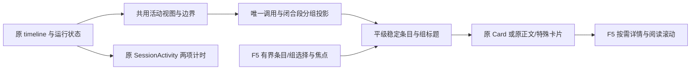

# F6 连续活动分组

授权沿用用户已批准的整体方案及本轮“继续”；F1–F5 已完成，本轮仅交付 F6，不重复请求方案审批。

## 0. 术语约定

- ActivitySegmentEntry：现有 ToolActivityView 活动，或带稳定 key 的正文/特殊边界。
- ActivityGroup：同 root/session、Agent、稳定轮次的连续完成普通活动；key 由作用域、Agent、轮次和首成员稳定 key 组成。
- groupCompletedActivities：无网络/时钟/日志扫描的纯分组投影，遵守 roadmap §4.4。
- ActivityTimeline：把原时间线投影为组标题和原条目；不替换原 timeline，不改变计时和正文输入。
- DisclosureChoice：复用 F5 open/closed；call/local/group 分别使用命名空间，组和条目合计受每会话 500 选择、50 会话上限约束。
- 闭合段：后继正文/特殊操作/异常、身份变化或已确认轮次结束关闭的普通活动段。运行项本身不使正在增长的普通尾段自动收组。

## 1. 决策与约束

落实 roadmap §4.4/§4.5/§4.7，默认工程档位，无新依赖。Codex 与 Claude 共用，分组属于展示投影，放在 SessionViewer 时间线渲染入口下的专用服务/组件，不修改会话存储或流事件。

仅已完成的普通 execute/read/list/search/web_search/fetch/MCP 可入组，连续至少 3 个唯一调用。同 Agent/轮次/root/session；缺 call ID、可靠 Agent 或轮次时单列。有效事实优先，旧字段经既有 buildToolActivityView 降级。文件变更、任务、用户 shell、提问/审批、失败/拒绝/取消/中断/未知状态单列；原始 kind/meta 的特殊属性也不能被冲突事实误收组。

任何文字段（不猜 phase）、思考、计划、todo、压缩、用户消息和身份变化均切段。普通运行项保留在同一开放段但不入组；段闭合后仅连续完成子段入组，运行项仍单列。当前会话 pending 或 streaming 时尾段保持开放；两者均结束且历史不在加载时可关闭尾段，断连或恢复提示本身不证明轮次结束。已显示后继 slash 结果等展示边界可关闭前段。组标题为“运行了 N 条命令”或“完成了 N 项操作”，固定文案支持中英文，不合计工具耗时。

普通组默认关闭。新组包含用户显式打开或当前聚焦的条目时保持可见；从已有用户阅读意图继承组的 open 选择，后续 blur/子项关闭不突然收组。用户显式关闭组时保留子项选择，重开恢复。焦点位于成员上时优先保持成员可见；用户主动点组标题收起则正常关闭。自动分组前后条目保持同一 React 父级和 key，不重建正在阅读的详情 DOM；关闭组为用户动作，可卸载组内条目以停止详情工作，重新打开只对用户此前明确展开的成员恢复详情，不批量拉取其他日志。

明确不做：F7 的真实 CLI/IDEA 安装和性能交付、消息协议/正文改写、生成任务语义、MCP 父子树、虚拟化、永久偏好、改变两项计时来源/显隐/优先级、改动审批/问答/diff/任务业务、提交推送。此前未提交的 F1–F5 修改全部保留。

## 2. 名词与编排

### 2.1 名词层：现状 → 变化

现状：SessionViewer 的 timeline.map 逐项调用 renderTimelineItem；useSessionStream 已给工具提供 agent/sourceTurnKey，buildToolActivityView 已提供 operation/state/source/ref。F5 的 activityDisclosure 按 call/local 保存选择，focus 只用于淘汰保护。没有 groupCompletedActivities 或 ActivityGroup 实现（已 rg 确认）。

变化：增加 roadmap 已约定的 ActivitySegmentEntry/ActivityGroup/groupCompletedActivities；时间线适配器使用原 item.id 和稳定引用映射回原条目，同调用的重复更新在首位置采用最新投影，不因 20 次更新计成 20 次操作。无 ID 只使用 local 时间线键。分组不扫描 content 文本或日志；特殊 kind/meta 是额外保守边界。

示例：A/codex/user:1 的 c1,c2,c3 均 complete + 后续进展文字 → [group(c1,c2,c3), 原进展文字]；只有 2 条仍逐项。相同 3 条作为运行中尾段 → 保持 3 条，结束后才收组。3 条完成 + running 尾项 → 执行期间全部逐项；后继文字闭合后 3 条成组且 running 单列。call 更新次数、locale、摘要变更不改变组 key；Agent/轮次/root/session 不同不合组。

展开存储新增组命名空间和可订阅的选择/焦点版本，不新增输出缓存。例：用户已打开 c2 后段结束 → 新组可见且 c2 的按钮/日志 DOM 和焦点不变；关闭组再打开 → c2 恢复，其他子项仍关闭；切 B 再回 A 保留组选择。应用刷新恢复普通组默认关闭。

### 2.2 编排层：现状 → 变化

现状：所有工具独立占行，时间线直接传给底部状态，详情属于原 Card。

变化：ActivityTimeline 只接管显示投影，渲染时插入轻量组标题，并按组开关挂载成员。每个原条目使用同一个稳定平级容器；自动成组只改变标题/缩进，避免成员重新挂到不同父容器导致焦点丢失。组控制器 aria-controls 指向展开后的成员容器 ID，关闭成员不进入键盘导航。纯投影不依赖展开选择；呈现层用 store 保护阅读与恢复用户选择。

原 timeline 继续传给 SessionActivity、正文渲染索引和跳转逻辑；组不是工具事件，也不写 lastEventAt。组区使用 F5 的 data-activity-reading，使点击/键盘操作暂停外层跟随。组标题和成员共享已有次级字体、主题与图标规则；正文仍独立且醒目，不增加卡片背景或组耗时。

### 2.3 挂载点

1. 分组纯计算与原时间线适配：稳定身份、唯一调用、闭合判断与保守特殊边界。
2. F5 展开存储/订阅扩展：组命名空间、焦点可见性与继承阅读选择，维持总内存上限。
3. ActivityTimeline/轻量组标题与 SessionViewer 唯一渲染入口、中英文文案及局部缩进样式；复用原正文和特殊工具渲染。
4. 分组/边界纯测试、真实浏览器焦点/详情请求/主题场景与既有计时/审批/历史回归。

### 2.4 推进策略

1. 分组投影：纯函数及适配器完成，阈值、闭合、边界、身份、计数验证通过。
2. 展开状态：组选择与焦点继承完成，50/500 总上限及子项选择保留验证通过。
3. 时间线接入：稳定成员与组标题挂入，类型检查通过，原特殊渲染保持。
4. 场景验证：真实浏览器、亮暗窄宽度、计时与 F5 回归、构建通过。
5. 验收归档：八项契约和九节报告完成，架构/能力/路线图同步，F6 done/F7 planned。

### 2.5 结构健康度与微重构

SessionViewer 已大，新分组计算/展开协调/组件放 services、hooks、components/stream 的明确职责文件；入口只替换 timeline.map 的调用，不在 SessionViewer 堆分组状态。现有目录可以承载，compound 无目录 convention 冲突。不做前置纯移动微重构；F5 小型 store/hook 就地扩展现有选择语义，不新建平行缓存。

## 3. 验收契约

- S1：0/1/2 不成组，3 个唯一完成普通活动在闭合后成组；开放尾段/仍在运行时不抢先收组。
- S2：正文、思考、计划/todo/压缩、特殊工具、异常和身份变化切段；顺序/原内容/特殊入口保持。
- S3：Agent/轮次/root/session 隔离，缺可靠身份不聚合；同调用重复更新计 1，语言/标题/成员追加不改变组 ID。
- S4：全命令/混合计数文案正确且中英文可切；普通组默认关，展开组不批量取日志，子项可各自打开。
- S5：主动展开与当前焦点在自动成组时保留同一 DOM；组开关、切会话恢复子项选择，组/条目共享有界存储与焦点保护。
- S6：亮暗、320/375/720、长摘要、键盘/aria/焦点，无外层横向溢出；进展和最终回答高于工具摘要。
- S7：两项计时的累计、最近事件、会话隔离/结束显隐/状态优先级不变；F5 详情滚动/迟到/复制与特殊业务回归。
- S8：相关测试/TypeScript/构建及文档校验通过；无日志扫描、额外详情请求、永久偏好、真实 CLI/IDEA 操作或 F7 提前交付。

## 4. 架构与能力归并

ui-tool-activity 归并闭合段投影、稳定平级渲染、组/子项选择与计时不受影响的纪律。compact-tool-activity 保留愿景，加入连续完成活动可收组的用户故事；两个索引、roadmap/items/矩阵同步。F7 仍待真实环境整体验证。
