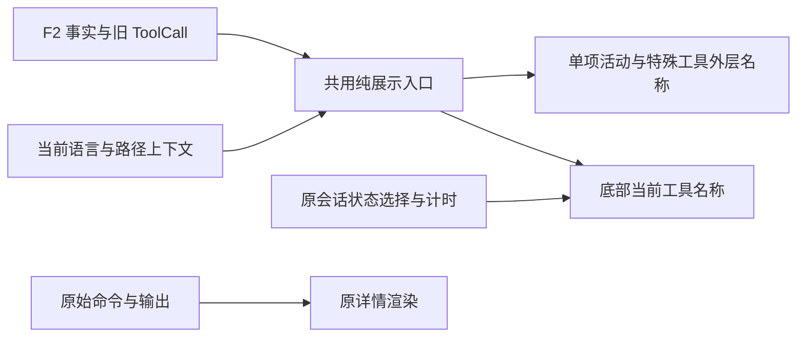

# F3 统一语义摘要与运行提示

授权沿用整体 roadmap 的明确批准及本轮“继续”。F2 已 done；本阶段实现 §4.3 的摘要规则和 §4.7 的底部名称接入，不重复请求方案批准。

## 0. 术语约定

- `ToolActivityView`：已有纯展示结果，稳定 key 不依赖语言/摘要；本阶段补全 summary/preview 计算。
- 语义摘要：仅依据已有描述、动作、名称和参数生成的本地化短文本，不猜测业务完成结果。
- 命令预览：原命令首个非空行的至多 100 个 Unicode 码点；仅可靠的简单 shell 包装可去除，完整原文不变。
- 两项会话计时：现有 SessionActivity 的累计等待与距上次更新时间，与工具摘要/工具耗时独立。

## 1. 决策与约束

为阅读 Codex/Claude 工作过程的用户提供可辨认的短摘要，同一工具在活动行和底部使用相同计算入口。走前端功能默认档位；复用 F2 可选事实及旧字段，不增加服务端契约。

优先级固定为已有描述 → 原生结构化动作 → MCP 可读名称/服务与工具名或保守命令预览 → 种类/状态缺省。没有事实的记录使用结构化旧 meta/input/locations；不逆向解析混合英文标题来推断原生命令动作。

明确不做：原生/历史字段回填、持久化摘要、活动分组、新详情加载/展开状态机、会话计时来源或状态优先级改造、审批/提问/用户 shell/diff/子任务内部交互、输入区变化。用户 shell 保留原始命令头部和默认展开例外；底部仍可用短摘要。F4–F7 保持 planned。

## 2. 名词与编排

### 2.1 名词层

现状：`services/toolActivity.ts:buildToolActivityView` 只消费描述、终态和工具耗时，多数工具沿用 title，未生成 preview；SessionActivity 直接读取工具 title，文件修改和子任务的旧头部也单独取标题。

变化：原展示接口不变，补全摘要计算并抽到同目录的专用计算文件。SessionActivity 接收可选 root/session/path 上下文，只用于调用同一展示入口；原状态选择和计时状态归属不变。

输入 → 输出示例：

- Codex execute + read(README.md) 与 Claude read + 相同动作 → `读取 README.md`；本地化为 `Read README.md`。事实的 operation 保持 execute，摘要不会改写执行行为。
- search(query=activity,path=src) → `在 src 中搜索 activity`；多种已知动作 → 带动作数量的通用操作摘要；显式空/混合未知动作不描述为纯读取。
- MCP displayName=项目文档 → 使用已有可读名称；否则 `github / get_issue`，缺字段逐级降级，不猜服务品牌。
- `npm test` → `运行 npm test`；多行 Python、heredoc、PowerShell/嵌套 shell 或复合脚本 → `运行脚本`；无法确定的引号退为通用命令。状态由 F2 证据显示，不宣称“测试通过”。
- 文件修改(path=src/app.ts) → `修改 src/app.ts`；任务使用已有描述、已知子任务操作或保守任务摘要。单文件外层不重复展示同一文件名，原 diff/任务详情不动。
- 中英文切换 → 固定文案切换，原生描述/命令不翻译，稳定 key 和用户展开选择不变。

路径只在已知 root 的分隔符边界内变为相对路径；外部路径仍可辨认，Windows 路径不被误当 POSIX 处理。摘要与预览上限均为 100 个码点，CSS 单行省略保护窄侧栏。

### 2.2 编排层

现状：活动行、特殊头部与底部名称各自取值；底部计时每秒更新。

变化：两处名称共用纯函数；底部只对当前工具投影，并在工具/语言/路径变化时重算，计时 tick 不反复解析参数。摘要不读取日志正文，不发请求；旧 JSON input 只做有界解析，复杂/损坏/过大输入降级。禁止 eval、命令执行、请求模型生成标题。

约束：优先级、原生结果、现有状态优先级保持不变；断连、待回答、发送、恢复、思考和等待仍由 SessionActivity 判断。新工具/输出事件按原机制更新时间，重绘/展开/语言切换不伪造事件。缺最近更新时间仍省略第二项，结束显隐不变。

### 2.3 挂载点清单

1. `services/toolActivity.ts` 的纯展示入口及新增摘要计算模块，消费原 activity/旧 meta，输出原 view 契约。
2. `ToolCallCard` 的普通行和文件修改/任务等旧外层名称，详情内部保留；中英文词典承载完整参数化文案。
3. `SessionViewer` 传递底部必要上下文，`SessionActivity` 只接入名称投影，样式保证状态文字省略且两项计时可见。
4. 现有工具活动浏览器夹具和计时回归，新增语义目录/复杂命令/本地化计算用例。

### 2.4 推进策略

1. 计算规则：实现描述、动作、MCP、命令与旧字段降级；固定输入目录覆盖中英文/复杂命令/非法值。
2. 展示接入：卡片外层和底部共用入口；类型检查通过，计时与原始详情所有权不变。
3. 行为与视觉验证：浏览器检查两个 Agent、切换语言、事件/展开/计时、主题与窄宽度；相关回归及生产构建通过。
4. 验收归档：逐项核对 S1–S8，更新现状架构/能力/roadmap，仅将 F3 标为 done。

### 2.5 结构健康度与微重构

当前 toolActivity 约百行、SessionActivity 约六十行；摘要规则放同目录专用文件，原入口保持编排职责。ToolCallCard/SessionViewer 较大，只改名称接线。知识库暂无 compound/convention 目录及冲突规则。不做前置微重构或目录移动，本阶段不扩张 App/适配器职责。

## 3. 验收契约

- S1：描述优先且保持原文；Codex/Claude 相同事实产生相同摘要，未知事实降级。
- S2：读/列目录/搜索/网页/抓取/修改/任务/MCP 的有信息与缺省场景可读；多动作/空动作不误述。
- S3：简单命令、包装、多行/heredoc/PowerShell/嵌套/不完整引号安全降级；不执行字符串，详情原文保持。
- S4：中英文、Unicode 长文本、路径根边界和 Windows 路径正确；稳定 key 不依赖语言/标题。
- S5：活动行与底部当前工具名称一致；断连/待回答/发送/恢复优先级不变，用户 shell/diff/任务/审批/提问交互保留。
- S6：工具切换、输出、展开/重绘、语言变化及会话切换不重置累计等待；最近更新、新轮次、缺时间与结束显隐沿原规则。
- S7：亮暗 × 窄宽度可读、无横向溢出、详情按需加载、原生耗时不挤掉状态或两项计时；浏览器和构建通过。
- S8：摘要不持久化、不读取大日志、不发网络请求，不提前实现 F4–F7；挂载点和文档与代码一致。

## 4. 与项目级架构文档的关系

更新 `ui-tool-activity` 的摘要优先级、调用关系、纯计算边界和底部只消费名称的规则；`compact-tool-activity` 补充统一语义摘要能力并保留愿景；F3 验收后同步 roadmap 主文档、items 和矩阵状态。
