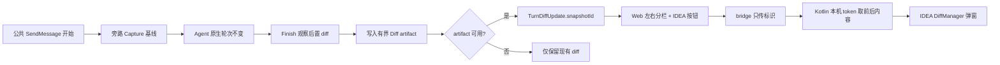

# turn-diff-viewer design

## 0. 术语约定

| 术语 | 定义 | 防冲突结论 |
|---|---|---|
| Turn diff | 一轮对话开始前到结束后，工作区文件修改的最终展示补丁 | 沿用 `TurnDiffUpdate` / `EventTypeTurnDiff`，不另起概念 |
| Snapshot | 本轮开始前的工作区观察基线 | 沿用 `internal/turndiff.Snapshot`，本 feature 只扩展结果 |
| Diff artifact | 为本轮可观察文件保存的前后内容快照及清单 | 新概念；仓库中无同名实现 |
| IDEA Diff dialog | IntelliJ `DiffManager` 打开的平台左右对比窗口 | 避免称“native diff”，防止与 Agent 原生 diff 事件混淆 |
| Side-by-side | Web 内置左右分栏 | 沿用 Git 面板已有说法和 `gitDiffModel` |

## 1. 决策与约束

### 需求摘要

- 做什么：`TurnDiffSummary` 选中文件后支持左右分栏；有快照的新记录增加“在 IDEA 中对比”按钮，打开 IDEA 原生 Diff 弹窗。
- 为谁：在 IDEA 中使用 Codex / Claude / ACP 的用户，需要复核一轮修改。
- 成功标准：local.14 已复现的 README 场景在聊天内可见左右分栏；新产生的记录可在后续手动修改文件后仍打开正确的本轮前后内容；点击查看不产生新的会话进展。
- 明确不做：不改 Agent 适配器、工具、提示词、权限、原生协议、会话发送和取消链路；不做 Git 提交对比；不把旧记录反推成左右快照。

复杂度走本地桌面插件默认档位，无高并发、对外 SDK 或多租户偏离。

### 关键决策

1. **两层体验**：Web 内置左右分栏满足快速阅读；IDEA Diff dialog 满足深度复核。二者共用同一份 Turn diff 语义，不引入两套“本轮”定义。
2. **精确原生弹窗必须持久化前后内容**：当前 aux 只保存 unified patch，不能可靠还原左右两侧，更不能在用户后续修改文件后保持历史准确。新记录写入有界 Diff artifact；旧记录不伪造。
3. **只对 workspace 已覆盖文件提供原生弹窗**：本地 workspace 观察已有 before/after 字节；native-only 且未被观察覆盖的文件继续只显示 unified diff。混合 diff 按 path 判断。
4. **JCEF 消息只传标识**：bridge payload 仍受 16 KiB 限制，只传 `rootId/sessionKey/snapshotId/path`。Kotlin 使用本机 runtime endpoint 和启动 token 调受保护本机接口取内容。
5. **旁路失败优先降级**：快照、artifact、接口或 IDEA 打开失败都不影响已产生的 diff 列表和 Agent 轮次；可用性通过按钮隐藏或 IDE 通知表达。

### 被拒方案

- 用当前文件和 Git HEAD 临时组 diff：回合开始时已有 dirty/staged 内容会被错误当作本轮修改，历史回看也会被后续手改污染。
- 从 unified diff 反推完整左右文件：上下文不完整、binary/空文件/mode-only 变化不可靠。
- 把文件内容直接放进 JCEF 消息：超过 bridge 限制且扩大敏感内容暴露面。

## 2. 名词与编排

### 2.1 名词层

**现状**

- `agent/types/types.go: TurnDiffUpdate` 只有 `turnId/diff/workspace/partial`，随 `session.ExchangeAux` 持久化。
- `session.ExchangeAux` 保存每轮最终 Turn diff；`usecase/session.go` 在公共 SendMessage 结束后调用 `finishWorkspaceTurnDiff`。
- `internal/turndiff.Snapshot/Result` 保留观察基线，`Finish` 生成最终 workspace diff，当前不返回前后字节。
- `TurnDiffSummary.tsx` 解析 patch 后用 `MarkdownViewer` 展示单栏；`gitDiffModel.ts` 已有左右行对齐和行内高亮模型。
- `AgentToolWindowFactory.kt` 的 JCEF bridge 已支持 `openFile`；`LocalRuntime.Connection` 已含 endpoint/rootId/token。

**变化**

- `TurnDiffUpdate` 增加可选 `snapshotId` 与 `comparePaths`。为空表示没有可用 Diff artifact，行为保持 local.14；`comparePaths` 只列出 artifact 中确有前后状态的 workspace 覆盖文件，避免 native-only 文件出现假入口。
- `turndiff.Result` 增加内部 changed-file 投影，包含映射后的 path、before/after 状态、mode、字节和 binary/文本判断；原有 `Diff/Partial` 语义不变。
- 新增 Diff artifact 清单：按 snapshot 保存文件级 before/after blob 引用、hash、大小、存在性、mode 和 binary 标记，不进入普通会话 HTTP payload。
- 新增内部 GET 接口：输入 session key、snapshotId、path，输出该文件 base64 前后内容和元信息；只允许本机 runtime token 访问。
- 前端 `TurnDiffSummary` 增加 side-by-side 渲染和 `compareTurnDiff` bridge action；timeline 向卡片传递 assistant seq。
- Kotlin 新增 `compareTurnDiff` action，用 runtime HTTP client 读取 artifact，再创建 `SimpleDiffRequest` 并调用 `DiffManager.showDiff`。

接口示例：

```text
GET /api/sessions/{sessionKey}/turn-diffs/{snapshotId}?path=README.md
X-MindFS-Local-CLI-Token: <runtime token>

200:
{
  "path": "README.md",
  "before": {"present": true, "binary": false, "dataBase64": "..."},
  "after":  {"present": true, "binary": false, "dataBase64": "..."}
}

404:
{"error": "turn diff snapshot unavailable"}
```

```ts
// 来源：runtime/web/src/services/ideaBridge.ts 新增导出
postToHost({
  action: "compareTurnDiff",
  rootId,
  sessionKey,
  snapshotId,
  path,
});
```

### 2.2 编排层



**流程级约束**

- Capture/Finish 仍在 Agent 轮外执行；失败路径与 local.14 一致，保留 native diff 或 workspace diff。
- artifact 写入发生在最终 diff 归并后；写失败只记日志并把 `snapshotId` 留空。
- artifact 存储有总大小和数量上限，超过上限标记该文件不可打开原生弹窗，不影响 diff 文本；后台按最旧 snapshot 清理。
- API 校验 snapshot 属于 session、path 在清单内、blob hash/大小匹配；所有路径必须留在 metadata root 内。
- Kotlin 请求失败或 IDEA 打开失败时显示 IDE 错误通知；Web 卡片和会话状态不变。
- 查看、滚动、打开弹窗均不写会话正文、不更新 `lastEventAt`、不触发 pending/streaming 变化。

### 2.3 挂载点清单

- `TurnDiffSummary` 文件详情区：新增 side-by-side 展示与 IDEA 对比入口。
- JCEF bridge action 注册：`compareTurnDiff`。
- 本机 API 路由：`GET /api/sessions/{key}/turn-diffs/{snapshotId}`，并纳入 local CLI token 白名单。
- Diff artifact 元数据目录：`.mindfs/turn-diffs/{snapshotId}/`，按根项目 metadata location 落盘。
- `TurnDiffUpdate.snapshotId` 持久化字段。

### 2.4 推进策略

1. 微重构：从 `GitDiffViewer` 抽出纯 Diff 代码表格渲染层，只搬不改行为；编译和现有 Git diff 回归通过。
2. Web 状态接入：Turn diff 卡片复用左右分栏渲染，传递 seq/session/snapshot 标识；组件测试覆盖新旧记录。
3. Artifact 数据面：扩展 turndiff 结果、清单持久化和保留策略；Go 单测覆盖 dirty/untracked/binary/delete/失败降级。
4. 内部 API：实现 session/path 校验和本机 token 保护；HTTP 单测覆盖 200/404/403/路径逃逸。
5. IDEA 弹窗：新增 Kotlin controller 和 bridge action，用短标识取内容并打开 DiffManager；编译与本地 host 冒烟。
6. 端到端验证：完整生产构建、Windows AMD64 本地包、后续手改文件后历史弹窗仍显示本轮内容。

### 2.5 结构健康度与微重构

评估：`.codestable/compound` 目录不存在，无既有 convention 可命中。

- 文件级：
  - `GitDiffViewer.tsx` 539 行，头部交互与代码渲染混合；本次必须复用其左右渲染，继续复制会形成第二套实现。
  - `AgentToolWindowFactory.kt` 344 行，低于阈值但已承担面板、bridge、语音和导航；新增 HTTP/弹窗逻辑应放新 Kotlin 文件。
  - `usecase/session.go` 4007 行，明显偏胖；本次只在公共 turn 结束处接 artifact 保存，具体逻辑放独立文件。
  - `turndiff/snapshot.go` 443 行，低于 500 行阈值。
- 目录级：`runtime/web/src/components` 已有 46 个同层文件；本次仅新增一个共享 Diff 渲染文件，不做一次性大规模重组。

结论：**微重构（拆文件）**。第一步从 `GitDiffViewer` 抽出纯渲染组件和行渲染 helper，行为不变；后续 `TurnDiffSummary` 复用该组件。`usecase/session.go` 的职责重划超出本 feature，列入观察项。

超出范围的观察：`usecase/session.go` 承担过多会话编排，建议后续按独立 refactor 处理；本 feature 不改变其对外语义。

## 3. 验收契约

1. 用户让 Agent 修改 `README.md`，回合结束后文件列表仍显示统计；选中文件在聊天内看到左右分栏、行号和行内高亮。
2. 新回合记录显示“在 IDEA 中对比”；点击后打开 IDEA 原生左右 Diff，左标题为本轮前、右标题为本轮后。
3. 弹窗打开后用户修改该文件并保存，重新从历史会话点击同一按钮，左右内容仍为本轮前后，不变成“Git HEAD → 当前文件”。
4. 删除文件、二进制文件、空文件和 mode-only 变化按清单元信息展示或给出不可对比提示，不崩溃、不影响其他文件。
5. local.14 旧记录无 `snapshotId` 时仍显示左右分栏；不显示 IDEA 原生对比按钮，不出现假 404 点击。
6. Capture、artifact 写入、HTTP 请求、IDEA DiffManager 任一环节失败时，Agent 原生轮次和现有 diff 卡片不受影响。
7. 代码反向核对：不修改 `internal/agent/codex`、`internal/agent/claude`、`internal/agent/acp` 的请求构造、工具、提示词和权限；查看动作不调用 SendMessage、不修改 exchange、不更新会话 pending 状态。
8. API 反向核对：未带本机 token 的请求不能读取 artifact；路径参数不能逃逸 metadata 目录。

## 4. 与项目级架构文档的关系

acceptance 时新增或更新 turn diff 专项架构文档，归档：

- Diff artifact 的数据边界与保留策略；
- Web 左右分栏复用关系；
- JCEF bridge → 本机 token API → IDEA Diff dialog 的调用链；
- “旁路观察，不影响原生 Agent 能力”的稳定约束。

`ui-tool-activity.md` 继续描述工具活动，不合并本能力；`ARCHITECTURE.md` 增加 turn diff 文档入口。
