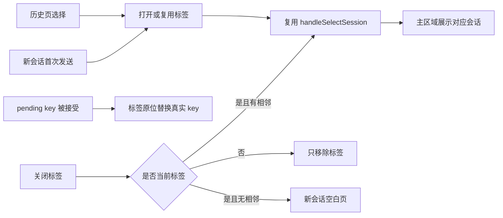

# session-tabs design

## 0. 术语

| 术语 | 定义 |
|---|---|
| 会话标签 | 当前前端生命周期内打开的会话视图入口，不代表会话运行状态 |
| 当前标签 | 主区域正在展示的会话 |
| 运行指示 | 复用现有 `pending` 呼吸灯，不新增状态模型 |

## 1. 决策与约束

### 需求摘要

- 在主内容区顶部增加 IDEA 文件标签式会话栏；少量标签直接平铺，空间不足时横向滚动并自动让当前标签可见。
- 新会话首次发送、历史页选择会话时打开标签；已打开的会话只切换，不重复创建。
- 标签按 `root_id + session key` 标识，并按项目隔离；`pending-*` 被服务端接受后原位替换成真实 key。
- 关闭标签只关闭视图，不取消、不删除会话；关闭当前标签后选择相邻标签，最后一个关闭后回到新会话空白页。
- 标签长标题截断但保留完整 `title`；支持鼠标、左右方向键、Home/End、Enter/Space，当前态和焦点态清楚。
- 历史页维持完整会话列表和现有搜索，不增加“正在运行 / 最近”分组。
- 第一版不跨 JCEF 重启持久化打开标签，避免扩张状态恢复范围。
- 不修改后端、多会话执行、WebSocket、Agent adapter、会话协议和 Marketplace 内容。

复杂度采用本地桌面插件默认档位：前端内存状态、少量并行标签，不引入持久化或跨进程一致性。

### 关键决策

- 标签是前端工作集，不是会话生命周期；关闭标签不改变后台运行。
- 当前项目最多以少量平铺标签为主，空间不足才出现滚动控制。
- 既有会话选择和 pending 状态是唯一事实来源，标签层不复制加载、发送或运行协议。

## 2. 名词与编排

### 2.1 名词层

- 新建独立 `SessionTabs` 组件，负责标签布局、键盘导航、自动滚动和关闭交互。
- `App.tsx` 仅维护各项目标签工作集，并在既有 `handleSelectSession`、新会话首次发送、pending key 提升和删除会话路径接线。
- 标签标题和 pending 状态从 `sessions`、当前选择及缓存投影，避免复制会话运行状态。
- 切换标签复用 `handleSelectSession`，不创建第二套加载或 URL 同步流程。

### 2.2 编排层

关闭分支不得调用 cancel/delete；运行灯只读取既有 pending 投影。快速切换时当前会话由 key/root 判定，不依赖滚动或动画完成。

### 2.3 挂载点

- `App.tsx`：标签工作集、打开/切换/关闭、pending key 提升、删除/根项目清理与主区挂载。
- `components/SessionTabs.tsx`：IDEA 式标签、溢出滚动和键盘交互。
- `ide.css`：标签选中、主题、截断、焦点和呼吸灯样式。
- `i18n/locales/*`：标签栏、滚动和关闭的无障碍文案。
- `tests/session-tabs.test.mjs`：真实 Chromium 交互、窄宽度、深浅主题和截图。

### 2.4 推进策略

1. 独立实现标签组件及窄宽度交互。
2. 在既有会话选择、新会话发送和 pending 提升路径做最小接线。
3. 回归历史页、运行状态、键盘、主题和插件构建。
4. 生成并核验 macOS arm64 本地测试包。

## 3. 验收契约

1. 打开三个会话后显示三个标签，点击任一标签展示对应内容。
2. 历史页点已打开会话只切换，点未打开会话新增标签；历史页仍只有全部会话和搜索。
3. 运行会话显示现有呼吸灯，完成后灯停止、标签保留。
4. 关闭标签不触发 cancel/delete；当前标签关闭后切到相邻标签，最后一个关闭后显示新会话页，历史页可重新打开。
5. `pending-*` 提升为真实 key 时不重复、不丢选中态。
6. 长标题、窄宽度、深浅主题和键盘切换可用，当前标签自动保持可见。
7. 前端回归、Gradle 插件构建和 macOS arm64 本地测试包验证通过。

## 4. 与项目级架构文档的关系

- 新增 `architecture/ui-session-tabs.md`，记录标签工作集与会话生命周期的边界、状态来源和接线流程。
- `architecture/ARCHITECTURE.md` 增加该能力入口。
- 新增 current requirement `requirements/session-tabs.md`，归档用户可见的快速多会话切换能力。
