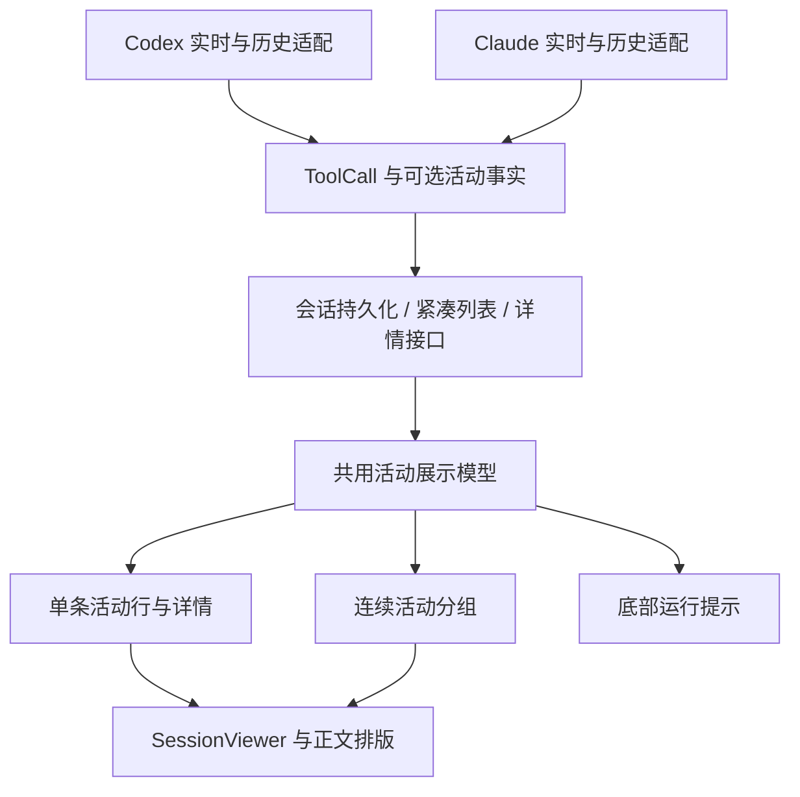

# 工具活动展示体验改造计划

> 已批准。用户于 2026-09-14 明确表示“方案我就不看了，直接审核通过”，授权按计划继续。保留双 Agent 共用展示和两项运行计时的既定范围。
>
> 在 `main` 上按一个子 feature 一个交付推进。F1–F6 已完成；F7 继续完成真实环境与组合验收。

配套：[子 feature 清单](tool-activity-experience-items.yaml) · [验收场景矩阵](acceptance-matrix.md) · [前期 Codex 调研](../../../docs/design/codex-tool-activity-research.md)。

## 1. 背景与成功标准

规划起点的工具输出虽然默认收起，但每条记录仍使用整行圆角边框、主文字颜色，以及包含原始命令的长标题。工具密集时，用户首先看到执行日志，进展说明与最终回答被挤到次要位置。F1–F6 已交付轻量单项行、原生状态/耗时、共用语义摘要、历史/缓存一致性、详情生命周期和连续分组，完整目标继续分阶段推进。

本项目的 Codex 与 Claude 共用 `SessionViewer`、`ToolCallCard` 和 `SessionActivity`。改造采用一套展示模型与组件，两个适配器提供真实数据。目标是接近用户提供的 Codex 桌面端截图的阅读体验，而不是复刻整个桌面应用。

完成后应满足：

1. 不展开详情，也能知道当前在做什么、是否完成、是否需要自己处理。
2. 正文里的进展说明和最终回答保持清晰可读，普通工具活动降低视觉权重。
3. 需要排查时可展开查看原始命令、参数、输出与错误，已有文件差异能力仍可使用。
4. 同一调用在实时流、切换会话、刷新、缓存恢复和原生历史导入中具有一致的可用信息展示规则。
5. Codex 与 Claude 使用相同的交互规则；缺失字段诚实降级，不要求两种协议提供完全相同的数据。
6. 分阶段交付，每阶段可演示、可测试、可回退，不要求一次完成整个计划。
7. 保留现有底部状态中的“已等待多久”和“最近更新于多久前”，持续可见于当前运行状态区，不被工具摘要、详情折叠或分组替代。

证据边界：参考截图能证明紧凑活动行、弱化颜色、命令截断与展开入口；不能证明桌面端所有分组边界、标题来源或展开状态机。本文相关细则是本项目已批准的产品规则，不宣称为 Codex 内部算法。

## 2. 范围与明确不做

### 2.1 已确认范围

| 区域 | 本次处理 |
| --- | --- |
| 普通命令、读取文件、列目录、搜索、网络搜索、抓取、MCP 调用 | 摘要、状态、耗时、图标、颜色、间距、折叠与详情入口 |
| 文件修改、子任务等工具记录 | 调整外层活动摘要和周边层级，复用现有 diff / 子任务详情与入口 |
| 连续工具活动 | 保守分组、组摘要、组内查看、分组边界 |
| 进展文字与最终回答 | 保留原文、顺序和现有正文渲染；调整与工具活动之间的间距和视觉权重 |
| 等待审批、等待回答、失败和中断 | 保持可见与可操作，避免被普通完成记录的分组隐藏 |
| 底部运行状态的两项计时 | 保留“已等待 {duration}”和“最近更新于 {duration}前”，沿用现有计时与显示生命周期 |
| Agent | Codex 与 Claude Code 同时覆盖，共用前端，各自适配原生工具事实 |
| 运行入口 | 以 IDEA/JCEF 插件为主；共用 Web 组件的其他现有入口做兼容回归 |

### 2.2 明确不做

- 输入框、发送按钮、模型选择器、会话列表、侧栏、设置、文件树的重新设计。
- 全站换肤、全站字体调整、复制 Codex 桌面端完整外观。
- 审批、提问、文件 diff、子 Agent 管理界面的内部操作改造。
- 思考内容的展示机制、自动生成进展正文、改写最终回答、整轮正文折叠。
- 删除或隐藏现有两项运行计时、将其移入折叠详情，或以单条工具耗时代替它们。
- 新增模型调用来给每条命令起标题，或从复杂脚本猜测“任务已完成”。
- 更换 SDK、重写 Agent 执行循环、改变工具执行、权限、队列或会话恢复语义。
- 用展示分组删减原始事件、自动重写原生历史文件、批量清除用户缓存。
- 由规划自动触发提交、推送、安装到用户 IDE 或发布版本；这些动作按届时用户指令处理。

### 2.3 两者一起做的具体含义

共用组件的一次变更必须同时验证 Codex 和 Claude；不做两份样式分叉。适配器的原生字段提取分别实现和验证：例如 Codex 的 `commandActions` 与 Claude Bash 的 `description` 都转换成同一套事实字段。

某个 Agent 没有提供耗时或语义动作时，使用相同的缺省规则。不会为了显示一致而编造字段。已识别的原生事件在历史导入中被过滤而缺失，属于本期历史一致性工作；更广泛的 SDK 能力缺失另记观察项。

## 3. 模块拆分与现状证据



| 模块 | 职责 | 当前承载位置 | 子 feature |
| --- | --- | --- | --- |
| 原生事实适配 | 从已有工具事件提取动作、来源、状态与耗时，不生产本地化 UI 文案 | `runtime/server/internal/agent/{codex,claude}/session.go`、`importer.go`；本地 SDK 类型 | F2、F4 |
| 会话传输与保存 | 完整详情持久化、紧凑数据投影、增量合并、按调用查询 | `runtime/server/internal/agent/types/types.go`、`runtime/server/internal/session/`、`runtime/server/internal/api/usecase/session.go` | F2、F4、F5 |
| 展示模型 | 用原生事实或旧字段生成两种 Agent 共用的语义、摘要和状态；纯计算 | `runtime/web/src/services/activityFacts.ts`、`toolActivity.ts`、`toolActivitySummary.ts`；F1–F3 已实现事实校验与共用语义摘要 | F1、F2、F3 |
| 活动行与详情 | 轻量外观、展开入口、详情加载、错误和复制；复用现有细节组件 | `runtime/web/src/components/stream/ToolCallCard.tsx` 及必要的新组件 | F1、F5 |
| 活动分组与正文编排 | 在既有时间线之上建立显示分组，保留事件和正文顺序 | `runtime/web/src/services/activityGrouping.ts`、`components/stream/ActivityTimeline.tsx`，SessionViewer 接入原时间线上下文 | F4、F6 |
| 主题、国际化与验收 | IDEA 主题、字号缩放、中英文、窄宽度、两种 Agent 联调 | `runtime/web/src/ide.css`、`i18n/`、现有浏览器测试与 smoke 脚本 | 各阶段、F7 |

规划起点与已落地的关键证据（历史基线保留，当前实现见架构）：

- Codex `codexCommandTitle` 将语义摘要与完整命令拼接；导入路径会将 shell 包装还原成标题。
- Claude `summarizeExecuteToolCall` 已优先使用 Bash 描述，可保留这一能力并接入共用展示规则。
- 规划起点两个历史导入器均对工具类型有过滤；F4 已移除可支持种类的过滤，并完成幂等补录和缓存恢复验证。
- `CompactToolCall` 会移除普通工具正文，保留按需获取完整详情的模式；不应把大日志重新塞回活动摘要。
- 当前普通 `ToolCallCard` 默认折叠，用户直接执行的 shell 命令有单独默认展开行为，应继续作为例外。
- 规划起点工具时间线缺少明确 Agent/轮次上下文；F4 已补可靠记录归属，F6 使用该上下文，不以当前选择器推断历史归属。
- F2 已保留 Codex 命令/MCP 的 `durationMs` 并贯通实时事实、完整与紧凑传输；Claude 无工具耗时的调用省略。正文 `phase` 尚未完整保留，本期按所有正文段切断分组即可，不把全量消息协议改造作为前置。

## 4. 共享接口契约（已批准 v1）

本节已随 roadmap 整体获批，作为所有子 feature 的共同约束。变更共享字段、默认规则或分组边界时先更新此处；内部函数拆法和具体文件改动归各 feature-design。

### 4.1 原生适配器 → 会话层 → Web：活动事实

沿用 `ToolCall` 和现有 `tool_call` / `tool_call_update` 事件，新增可选顶层字段 `activity`。Go 定义为可省略指针，Web 定义为可选属性。旧读端可忽略，新读端兼容缺失字段；不改现有 `title`、`status`、`meta.command` 的存量含义。

```ts
type ActivityAgent = "codex" | "claude";
type ActivityState =
  | "running" | "completed" | "failed" | "declined"
  | "cancelled" | "interrupted" | "unknown";
type ActivityOperation =
  | "execute" | "read" | "list" | "search" | "web_search"
  | "fetch" | "file_change" | "mcp" | "task" | "other";
type ActivityAction =
  | { type: "read"; name?: string; path?: string }
  | { type: "list"; path?: string }
  | { type: "search"; query?: string; path?: string };

type ActivityFactsV1 = {
  schemaVersion: 1;
  agent: ActivityAgent;
  origin: "live" | "imported";
  operation: ActivityOperation;
  source: "agent" | "user_shell" | "unknown";
  nativeTurnId?: string;
  parentCallId?: string;
  actions?: ActivityAction[];
  displayLabel?: {
    text: string;
    source: "native" | "tool_argument" | "tool_metadata";
  };
  tool?: { name: string; server?: string; displayName?: string };
  outcome?: Exclude<ActivityState, "running" | "unknown">;
  durationMs?: number;
};

// 现有 ToolCall 增量扩展：activity?: ActivityFactsV1
```

约束：

1. `activity` 只存展示所需事实，不重复存完整命令、日志或 diff。原文沿用现有详情字段与存储。
2. Codex 读取 `commandActions`；Claude 读取工具名、结构化输入、Bash 描述、`tool_result`。未知动作可没有 `actions`。
3. `outcome` 仅在已有工具终态事件提供证据时写入；拒绝、失败、取消保持区别。轮次结束不能直接给所有未完成调用补成功。
4. `durationMs` 必须是原生事件提供的本次工具耗时，且为有限非负数；缺失即省略。会话等待时间不能冒充工具耗时，0 是有效值。
5. `parentCallId` 必须来自明确的工具父子关系；并发、时间相近或相同 MCP 名称不足以建立嵌套。
6. 已有描述可直接展示，但不翻译、改写为模型新生成的任务结果；固定 UI 文案在前端本地化。
7. `nativeTurnId` 不可得时省略，分组使用稳定的已存储用户消息作为备用边界；两者皆无时不聚合。
8. 未知 `schemaVersion`、字段非法或不支持的 Agent：忽略该活动事实并使用旧字段降级，不导致消息渲染失败。
9. 同一调用更新时按字段合并 `activity`；缺失字段不覆盖已有值，`actions` 出现时整体替换数组。终态元数据以更晚的有序原生终态更新为准，历史重放不把终态回退到 running。
10. 新旧混合数据只保存事实，不保存中文/英文格式化后的摘要，切换语言无需重写历史。

### 4.2 列表、详情与错误

沿用现有接口：

```http
GET /api/sessions/{sessionKey}/toolcalls/{callId}?root={rootId}
200 { "toolcall": ToolCall | null }
```

现有处理器对缺失文件返回 404，其余取数错误或参数错误可能返回 400；认证与权限响应沿用公共 HTTP 层。本计划不擅自改错误码。Web 层将它们转换成下面的本地结果：

```ts
type ActivityRef = { rootId: string; sessionKey: string; callId: string };
type ActivityDetailResult =
  | { kind: "loaded"; toolCall: ToolCall }
  | { kind: "missing" }
  | { kind: "unavailable"; retryable: boolean; message: string };

declare function loadActivityDetails(ref: ActivityRef, signal?: AbortSignal):
  Promise<ActivityDetailResult>;
```

- `200 null` 或 404 → `missing`，显示“详情暂不可用”，仍可阅读摘要。
- 网络/临时服务失败 → `unavailable`，显示重试；权限、参数失败不自动无限重试。
- 折叠态不触发详情请求；展开活动组只展示子项，不请求每个子项的日志。
- 同一调用并发请求合并。会话切换或调用变化后，迟到响应不得写入另一条详情。
- 日志后续增量更新不使活动重新计数，不抢占外层滚动位置；用户已向上阅读时不强制滚到底。
- 元数据/摘要加载成功与日志加载成功分开处理；失败不能让整条工具记录消失。

### 4.3 展示模型 → 共用组件

```ts
type ActivityContext = {
  rootId: string;
  sessionKey: string;
  agent?: ActivityAgent;
  sourceTurnKey?: string;
  rootPath?: string;
  locale: "zh-CN" | "en-US";
  requiresInteraction: boolean;
};
type ToolActivityView = {
  key: string;
  ref?: ActivityRef;
  agent?: ActivityAgent;
  operation: ActivityOperation;
  state: ActivityState;
  summary: string;
  preview?: string;
  durationMs?: number;
  source: "agent" | "user_shell" | "unknown";
  hasDetails: boolean;
  requiresInteraction: boolean;
  sourceTurnKey?: string;
};

declare function buildToolActivityView(call: ToolCall, context: ActivityContext): ToolActivityView;
```

`buildToolActivityView` 是无网络、无副作用的共用计算入口。活动行、组内子项、底部运行提示中的工具名称/摘要都消费这一结果，不能各写一套标题规则。底部现有的等待、断连、恢复与待回答状态优先级及两项运行计时继续保留；本模型不接管计时。

摘要选择顺序：来源明确的 `displayLabel` / 已有工具描述 → 结构化动作 → MCP 服务与工具名称或短命令预览 → 按工具种类和状态生成通用文案。F1 可以先实现该契约的旧字段降级子集；F3 补齐全部语义规则。

命令预览最多取首个非空行的 100 个 Unicode 码点，剩余部分省略；实际显示仍以容器单行省略处理。多行脚本用“运行了脚本”等摘要，已知简单 shell 包装可以仅在预览里去除。无法可靠解析的引号、嵌套或脚本不尝试求值，完整原文留在详情。

有动作但夹杂无法解释的其他命令时不把整个调用称为“只读取文件”。不存在描述时不会猜测“构建成功”“修复完成”等业务结果。

稳定标识采用 `JSON.stringify([rootId, sessionKey, callId])`，不使用摘要、状态、语言或数组位置。无 `callId` 的旧记录沿用稳定时间线 ID，只做本地展示，不请求远程详情、不参与聚合。

### 4.4 时间线 → 分组投影

```ts
type ActivitySegmentEntry =
  | { type: "activity"; view: ToolActivityView }
  | { type: "boundary"; key: string };
type ActivityGroup = {
  type: "activity_group";
  key: string;
  sourceTurnKey: string;
  agent: ActivityAgent;
  items: ToolActivityView[];
};

declare function groupCompletedActivities(
  entries: readonly ActivitySegmentEntry[],
  context: { closedTurnKeys: ReadonlySet<string>; minGroupSize: 3 },
): readonly (ActivitySegmentEntry | ActivityGroup)[];
```

- 只聚合同 Agent、同稳定轮次、连续的已完成普通操作，至少 3 项。默认候选：执行、读取、列目录、搜索、网络搜索、抓取、MCP。
- 文件修改、子任务、用户 shell、等待交互、失败、拒绝、取消、状态未知全部单列。
- 任意正文段、用户消息、思考块、计划、todo、压缩提示、Agent 或轮次变化均是边界。已有正文不参与分组，顺序不变。
- 运行中的开放尾段保持逐项展示；普通 running 项不提前关闭这个段。出现后继边界或轮次确实结束后，才把段内足够数量的连续完成子段收组，运行项仍单列。pending/streaming 未结束或历史仍在加载时，不仅凭断连/恢复提示关闭尾段。
- 组 ID 由 session、Agent、轮次和首个成员稳定 key 产生；后续追加成员不改变已有组 ID。
- 全部是命令时显示“运行了 N 条命令”；混合类型显示“完成了 N 项操作”。计数按唯一调用，不按事件或轮询次数。
- 不构造截图中未证实的 MCP 父子调用树。本期只保留已有明确关联及现有入口。
- 阈值和收组时机已获整体批准，并由 F6 实现及验证；组仅为展示投影，原 timeline 继续用于正文和两项计时。

### 4.5 展开状态与交互状态

```ts
type DisclosureChoice = "open" | "closed";
type ActivityDisclosureState = {
  items: ReadonlyMap<string, DisclosureChoice>;
  groups: ReadonlyMap<string, DisclosureChoice>;
};
```

普通活动、完成活动组默认关闭。用户 shell 保留现有默认展开例外。待审批/提问使用现有交互卡片，不受普通工具的默认折叠控制。

用户点开后的选择优先于状态更新、输出增量、结束事件和父组件重绘。记录在当前应用会话内按 root/session 隔离，切换回来保留；浏览器刷新或插件重启恢复默认折叠，本期不增加永久偏好。

同一页面正在聚焦或展开查看的调用完成时，不因自动收组隐藏内容或移走焦点；存在显式打开的子项时，包含它的新组初始保持可见。新组继承已有阅读意图为 open 选择，后续 blur 不突然收起；条目在自动成组前后保持同一平级 React 父级与 key。折叠组时保留子项选择，再展开组恢复。

应用会话内的记录使用有界缓存：最多保留 50 个会话、每会话合计 500 个条目/组展开选择，按最近使用淘汰；当前挂载且聚焦的条目不在本次交互中淘汰。不会持久化完整工具输出。

### 4.6 历史兼容与混合 Agent 会话

- `activity.agent` 优先，其次使用所属 exchange 的 `agent`；仅在确知全会话单 Agent 时使用会话默认值。不能用当前选择器里的 Agent 改写历史归属。
- 原生完整事实优先，旧 `meta` / `title` 作为降级输入。旧记录也可立即获得紧凑外观与保守摘要，但没有原始数据的记录不能保证补出耗时或缺失操作。
- 对可获取的原生历史由两个 importer 补齐已支持工具类型的投影，不修改原始日志；重复导入必须幂等、不重复新增调用。
- 紧凑交换数据、完整工具存储、WebSocket、IndexedDB 必须保留 `activity`；不在查询全部历史时额外逐项取工具详情。
- 默认不提高缓存版本、不清空缓存。只有确认旧缓存阻断已补齐事实且无法增量合并时，F4 的 design 才可提出局部重建策略及独立验证。
- 当前原生/存储缺失的正文 `phase` 不强行回填。本期所有文字段都是分组边界；正文与工具之间的层级不依赖猜测哪一段是最终回答。

### 4.7 底部运行计时保留契约（用户明确要求）

现有 `SessionActivity` 的两项信息继续显示，例如：`已等待 1 分钟 10 秒 · 最近更新于 5 秒前`。适用于 Codex 和 Claude；它们属于运行状态区，不是工具活动组的成员。

- **已等待时长**：沿用当前轮次开始时间的计算口径，每秒刷新，保留秒、分、小时格式化。工具切换、新输出、展开/收起和分组不能重置累计时间。
- **距离上次更新时长**：沿用 `sessionService` 提供的该会话 `lastEventAt`；收到被现有事件机制接受的新进展后更新。组件重绘、展开详情和旧事件重放不能伪造一次新进展。
- **会话隔离**：切到其他会话再返回仍使用各自保存的时间；新组件挂载不能借用另一个会话的计时或重新从零开始。
- **初始状态与结束状态**：尚无有效最近更新时刻时，沿用当前省略第二项的行为；状态区的显示条件及结束后撤除行为保持原状，本期不新增永久完成计时。
- **可见性**：状态区存在期间，两项可用计时保持可见；不因工具活动折叠、分组或精简视觉而隐藏，不降为悬停提示。
- **与工具耗时分离**：`activity.durationMs` 只用于单项工具摘要。即使有工具耗时，也不能替换这两项会话级计时。
- **实现边界**：F3 只统一底部工具名称/摘要，F5 保证生命周期，F6 保证分组不影响状态区；计时数据来源与语义沿用现有实现。

## 5. 子 feature 清单

以下顺序是技术依赖和逐步观察体验的建议，尚不代表确定工期。F1–F6 已验收完成，F7 为 `planned`；机器清单保持一致。

### F1 · activity-compact-rows — 共用轻量活动行（最小闭环）

- 模块：展示模型、活动行、正文编排、国际化。
- 依赖：无。
- 交付：Codex 与 Claude 的普通工具改为无默认外框的轻量摘要行；旧字段即可工作；原有详情可以点开；文字原文与顺序保留。
- 首轮范围：普通命令、读取、搜索、MCP；修改/任务只调整外层容器时不得改变内部详情。用户 shell、审批与提问保留例外。
- 验收：两个 Agent 各一条真实组件/服务驱动的调用，从开始、完成到点开详情；长命令不撑宽；亮暗与窄侧栏可看；暂无活动事实也可正常展示。
- 演示：同一组代表性工具记录的当前版与轻量版对照，以及单项详情展开。
- 退出条件：用户能评审一版可运行的最小体验，相关组件测试与类型检查通过。
- 回退：恢复旧外观及原摘要入口；不涉及数据迁移。
- 状态：`done`；对应 feature：`2026-09-14-activity-compact-rows`。见 [F1 验收](../../features/2026-09-14-activity-compact-rows/activity-compact-rows-acceptance.md)。

### F2 · activity-native-facts — 两种原生工具事实贯通

- 模块：两个实时适配器、SDK 类型、共享 ToolCall、会话传输与保存。
- 依赖：F1；原因是已有共用展示入口可检查增量字段的实际效果，并作为向后兼容基线。
- 交付：实现 §4.1；Codex 的动作/耗时和 Claude 的描述/工具结果进入共用事实；完整及紧凑数据均保留；终态证据不被通用结算覆盖。
- 验收：协议输入 → 适配器 → 会话保存/列表/详情 → Web 收到一致事实；未知字段、缺省值、0 耗时、失败和拒绝均覆盖。
- 演示：两种 Agent 的工具状态和可用耗时；没有耗时的 Claude 调用不显示伪造计时。
- 回退：字段为可选，旧渲染可忽略；原始详情及旧字段不丢失。
- 状态：`done`；对应 feature：`2026-09-14-activity-native-facts`。见 [F2 验收](../../features/2026-09-14-activity-native-facts/activity-native-facts-acceptance.md)。

### F3 · activity-semantic-summaries — 统一语义摘要与运行提示

- 模块：展示模型、国际化、活动行、底部运行提示。
- 依赖：F2；原因是需要其结构化动作、来源和终态证据。
- 交付：完整实现 §4.3 的优先级及缺省规则；统一读取/搜索/脚本/MCP/修改/任务的摘要；底部提示的工具名称共用摘要，并按 §4.7 保留两项运行计时与既有状态优先级。
- 验收：中英文固定文案、原生描述保留、Unicode 截断、复杂 shell 可靠降级、混合动作不误述；摘要与完整详情一致但不重复堆积原始命令。
- 演示：代表性工具摘要目录，两种 Agent 并排展示同类操作。
- 回退：回到 F1 的通用短摘要，仍可读完整详情。
- 状态：`done`；对应 feature：`2026-09-14-activity-semantic-summaries`。见 [F3 验收](../../features/2026-09-14-activity-semantic-summaries/activity-semantic-summaries-acceptance.md)。

### F4 · activity-history-parity — 历史、缓存与实时一致

- 模块：两个历史 importer、会话数据、时间线上下文、缓存投影。
- 依赖：F2、F3；原因是需要统一事实契约及摘要规则作为对比基线。
- 交付：补齐现有可识别工具在原生历史中的活动投影；刷新/缓存/导入走同一展示规则；显式携带所属 Agent 与稳定轮次边界。
- 验收：实时 → 切走返回 → 刷新 → 重新导入，多次操作不重复；已有历史缺字段可读；混合 Agent 会话不串归属；原始日志不被修改。
- 演示：同一会话经过上述路径，摘要和可用状态保持一致。
- 回退：停用新增历史事实补全，继续使用旧字段降级；不得删除历史或全部用户缓存。
- 状态：`done`；对应 feature：`2026-09-14-activity-history-parity`。见 [F4 验收](../../features/2026-09-14-activity-history-parity/activity-history-parity-acceptance.md)。

### F5 · activity-detail-lifecycle — 展开、流式详情与异常状态

- 模块：详情加载、活动展开状态、会话更新、现有特殊交互入口。
- 依赖：F2、F3；原因是需要稳定调用身份、可判定终态和统一展示模型。
- 交付：实现 §4.2、§4.5；主动展开选择在流式更新及切换会话后保留；详情缺失/失败可理解且可重试；原始命令/输出可复制；§4.7 的累计等待与最近更新计时不被组件生命周期重置。
- 验收：迟到响应、并发请求、断连重放、输出增长、手动向上阅读、失败/取消/中断、审批/提问；普通组不能遮住待处理动作。
- 演示：执行中打开日志、滚动阅读、工具结束、切换返回、详情重试。
- 回退：恢复原详情展开实现；终态事实仍保留，不能恢复为伪造成功的展示。
- 状态：`done`；对应 feature：`2026-09-14-activity-detail-lifecycle`。见 [F5 验收](../../features/2026-09-14-activity-detail-lifecycle/activity-detail-lifecycle-acceptance.md)。

### F6 · activity-segment-grouping — 连续活动分组与正文节奏

- 模块：分组投影、组组件、正文编排、展开状态。
- 依赖：F3、F4、F5；原因分别为统一摘要、稳定历史/轮次/Agent 身份、可靠的双层展开行为。
- 交付：实现 §4.4；同一闭合段内足量完成活动收组；进展说明和最终回答等正文保持在原位置；组内按原顺序看单项。
- 验收：0/1/2/3/多项阈值、连续及交错操作、混合类型、相同 callId 更新、Agent 切换、失败与交互边界、已展开条目完成时不消失。
- 演示：工具密集的完整一轮对话，包括执行中、段落切换、完成、组展开和单项详情。
- 回退：关闭分组投影，保留已经验收的轻量单项展示。
- 状态：`done`；对应 feature：`2026-09-14-activity-segment-grouping`。见 [F6 验收](../../features/2026-09-14-activity-segment-grouping/activity-segment-grouping-acceptance.md)。

### F7 · activity-ide-readiness — IDEA 场景整体验收与交付

- 模块：主题、焦点、响应式、两种 Agent 回归、构建与文档。
- 依赖：F6；原因是需要完整展示链路进行最终组合验证。
- 交付：经验证的本地插件包、场景对照图、验收记录与已知限制；具体包版本在该阶段确定，不提前改版本号。
- 验收：IDEA/JCEF 的主题/缩放/复制/键盘；两个 Agent 的端到端场景；审批/问题/diff 入口；长历史与大输出；既有重点回归。
- 演示：在真实 IDEA 中读完一轮对话并按需查看工具详情。浏览器合成事件通过不能替代真实 IDE 和真实 CLI 的验收声明。
- 回退：本地包回到前一已验收版本；数据兼容保证旧版本仍可读取旧字段。
- 状态：`in-progress`；对应 feature：`2026-09-14-activity-ide-readiness`。见 [F7 部分验收](../../features/2026-09-14-activity-ide-readiness/activity-ide-readiness-acceptance.md)；浏览器、构建、本地包及真实 Codex 已通过，Claude 超时、IDEA/JCEF 待完成。

**最小闭环**：F1 做完即可通过现有数据链路演示两种 Agent 的单条轻量活动、状态变化与详情；无需等历史补全或分组完成。

## 6. 推进方式与阶段评审


- G0：范围和整体规则已由用户明确批准，包括普通活动默认折叠、至少 3 项才分组、正文始终可见、用户 shell 保留例外。F1 已完成真实组件示例、交互验证与截图核验。
- 每次只推进一个子 feature：写该阶段 design → 明确交付范围 → 实现 → 针对性测试 → 演示/验收 → 回写该条状态。用户本次要求“慢慢做”，因此计划不会自动触发后续所有阶段。
- F4 与 F5 没有彼此依赖，可交换顺序；表中先 F4 是方便尽早检查存量历史的建议，不是技术硬限制。本计划不安排并行代理或并行施工。
- 每阶段汇报包含：可见变化、改动范围、实际验证、残余问题、对应截图/记录、下一阶段。不得把未运行验证标成通过。
- 每阶段完成后形成清楚的差异边界；提交、推送和发布按届时用户指令处理，不将本次规划当作授权。
- 不给无依据的天数承诺。以可验收小交付计进度，F1 验收后再根据协议/历史数据发现估算后续工作量。

## 7. 验证策略

完整用例见 [验收场景矩阵](acceptance-matrix.md)。F1–F6 已执行各自范围的应用测试，具体证据见对应验收报告；后续阶段检查仍待执行，不能据此宣称整体通过。

| 层次 | 重点 | 执行时机 |
| --- | --- | --- |
| 纯计算 | 摘要优先级、状态降级、Unicode、分组边界、计数与稳定 ID | F1/F3/F6 |
| 协议与存储 | 两种原生输入、活动事实的增量合并、紧凑/完整一致、历史导入幂等 | F2/F4/F5 |
| 浏览器组件 | 实际共用组件接真实 hook/service，展开、滚动、切换、重试与焦点 | 每个相关 UI 阶段 |
| 构建与回归 | TS、相关 Go 测试、既有会话/审批/提问测试、打包资源 smoke | 相关阶段及 F7 |
| 真机 | IDEA/JCEF 主题、缩放、复制、真实 Codex/Claude 调用与历史恢复 | F7；环境可用时可提前采样 |

复用已存在的命令入口，具体测试名在 feature-design 中确定：

```sh
# 仓库根目录：通过已有隔离脚本运行相关 Go 测试
node scripts/test-runtime.mjs ./server/internal/agent/codex ./server/internal/agent/claude ./server/internal/session ./server/internal/api/usecase -count=1

# runtime/web 目录
pnpm typecheck
node --test tests/session-activity-lifecycle.test.mjs tests/session-stream-lifecycle.test.mjs tests/session-cache-migration.test.mjs

# 仓库根目录；存在对应已构建运行时后执行
node scripts/smoke-runtime.mjs --delivery-only
```

新增测试验证用户行为与事件链路，不依赖搜某个源码字符串来证明功能。修改 SDK 时增加其对应类型/反序列化测试。构建依赖、平台和本机安装情况以该阶段实际环境为准。

视觉核验每个 UI 阶段集中检查一次相关宽度/主题，修复后确认一次；通过后进入阶段验收，不无限循环微调。

## 8. 风险、回退和决策记录

| 风险 | 应对 |
| --- | --- |
| 两种 Agent 字段不对称 | 共用 UI 接受可选事实；缺失时稳定降级，专项协议样例分开测 |
| 历史 importer 过滤了读取/搜索/MCP 等记录 | F4 逐类型核验并补现有可支持的投影；不从缺失数据虚构记录 |
| 摘要错误描述复杂脚本 | 使用来源明确的描述或通用脚本文案；不在前端执行 shell / JS |
| 分组让执行过程难找 | 正文、交互、失败、修改、任务为边界；只有完成普通操作收组 |
| 流式更新导致内容跳动或关闭 | 稳定 ID、显式展开状态、闭合段才收组、保持焦点与滚动意图 |
| 旧数据/缓存不具备新字段 | 可选契约与旧字段降级；不做默认全量清缓存 |
| 底层事件重复或迟到 | 使用现有有序事件/重放游标，工具按 callId 去重；状态不因旧事件回退 |
| 真实 CLI / IDEA 环境暂不可用 | 保留明确未验收项；可交付模拟/浏览器证据，但 F7 不宣称真机已通过 |

已由用户确认：本期只改工具活动区与正文层级；两种 Agent 共用组件则一起做；现有“已等待多久”和“距离上次更新多久”两项状态必须保留；后续默认在 `main` 开发；本轮先写详细计划，分阶段推进。

已批准的实施规则：至少 3 项才分组、仅闭合段自动收组、永久展开偏好不入本期、用户 shell 默认展开例外；F4/F5 依赖不变，按清单建议顺序逐项推进。

## 9. 观察项

- 规划起草时知识库只有 attention 与 issue 记录。F1 实施后已补齐该能力的 feature、requirement 与局部 architecture；尚未制作整个仓库的架构地图，校验继续使用已安装技能中的工具。
- 前期 Codex 调研中的协议字段有实机生成类型证据；F2 已用两个 SDK 的固定协议样例、实际适配器输出及浏览器组件核验。历史样例与真实目标 CLI 仍分别在 F4/F7 检查。
- 本机是否可完成 Claude 实际运行及 IDEA/JCEF 自动化，在对应阶段核验；不沿用旧文档的环境状态当作今天的事实。
- Codex `agentMessage.phase` 未完整贯通。本期无需依赖它来隐藏正文，暂不引入消息存储重构；若未来要区分整轮进展/最终回答容器，另开需求。
- 共用 Web 层还存在其他入口。兼容回归纳入 F7，但移动端全新设计、其他 Agent 专项适配不扩展到本期。

## 10. 规划自查与变更日志

本轮规划自查结果：

- 6 个模块明确职责、现有承载位置及对应子 feature；共享数据、纯计算入口、详情接口、分组与展开状态契约已列出。
- 主文档 frontmatter 和 items.yaml 已通过技能包提供的 `validate-yaml.py`；项目内缺该脚本，因此直接使用已安装技能中的同一工具，没有初始化额外目录。
- 额外使用 YAML 解析检查了 7 条子 feature 的必需字段、slug 唯一性、引用有效性、DAG 无环、唯一最小闭环，以及正文 F1–F7 与机器清单一致。
- 本地文档链接均可解析；初稿 56 个验收场景 ID 唯一，追加 A22–A28 专门保护两项运行计时，共 63 项。F1–F6 各有唯一 feature 目录，未发现命名冲突。
- 已明确范围、例外、回退与观察项；F1 的代码、能力与现状架构按已批准范围落地，原有特殊交互与计时保留。
- 范围及整体技术方案已获用户确认，F1–F6 已完成；F7 已开始，Claude 和 IDEA/JCEF 实机验收仍未完成。

- 2026-09-14：建立草案。按用户最终确认，范围锁定工具活动与正文层级，共用展示覆盖 Codex 和 Claude；此前“仅 Codex”选项已被用户后续指示替代。
- 2026-09-14：按用户“用了多少秒、距离上次更新多少秒要保留”的明确要求，新增 §4.7 保留契约并同步 F3、F5 和验收矩阵；阶段依赖不变，尚无已启动 feature 受影响。

- 2026-09-14：用户明确审核通过整体方案；将草案提升为正式 roadmap，启动 F1。

- 2026-09-14：F1 实现和验收完成。共用轻量行、旧字段摘要、详情与计时保护已验证；主文档和 items.yaml 同步 done，F2–F7 保持 planned。
- 2026-09-14：按用户“继续”实施并验收 F2。两个实时适配器的可选事实、可靠终态、原生耗时、完整/紧凑保存与 Web 展示已贯通；兼容降级和两项计时回归通过。F2 同步 done，F3–F7 保持 planned；未执行真实 CLI 或 IDEA/JCEF 联调。

- 2026-09-14：按用户“继续”完成 F3。活动行、文件/任务外层与底部提示共用本地化语义摘要，复杂命令保守降级；双 Agent、原始详情和两项会话计时回归通过。F3 同步 done，F4–F7 保持 planned。

- 2026-09-14：按用户“继续”完成 F4。双 Agent 历史投影、稳定调用补录、旧缓存完整紧凑补录后增量恢复、混合归属和 pending 保护已验证；不升级或清空缓存，保留两项计时。F4 同步 done，F5–F7 保持 planned。

- 2026-09-14：按用户“继续”完成 F5。50 会话/500 条目有界展开选择、共享在途详情、错误分类和取消、运行/终态更新、滚动意图与原文复制已验证；保留底部两项计时。F5 同步 done，F6/F7 保持 planned；真实 CLI 与 IDEA/JCEF 尚未运行。

- 2026-09-14：按用户“继续”完成 F6。闭合连续完成段分组、稳定身份/唯一计数、组与子项选择、原 DOM/焦点保留及按需详情通过纯计算与真实 SessionViewer 浏览器验证；正文/特殊操作及两项计时保留。F6 同步 done，F7 保持 planned，真实 CLI/IDEA 和最终性能基线未执行。

- 2026-09-14：F7 部分推进。16 组布局/缩放、1000 项对照、1 MiB 日志、Web/Go/Kotlin/包内 smoke 通过；修复 Codex 原生 exec 包装重复和失败误判，新会话完整同步通过。交付本地 macOS arm64 预览包；Claude 180 秒无终态、IDEA/JCEF 可操作证据不足，F7 保持 in-progress。

- 2026-09-14：用户批准推送 main 并发布 0.1.14，交付 F1–F6 与 F7 已验证修复；不把发布动作作为剩余 Claude/IDEA 实机检查通过的证据，F7 保持 in-progress。
